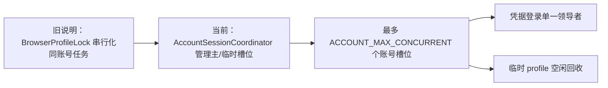

# Wise RPA 架构改动说明

> 对比基线：修改前的 `doc/架构说明文档.md`。核对基准：2026-08-07 的当前代码树。本文只记录架构与能力结论的变化，不替代完整架构说明。

## 1. 变更摘要

本次核对确认，系统已从“每个浏览器 profile 互斥执行”的队列 Worker 形态，演进为“中心平台分配队列、设备 Agent 监管独立 Worker、设备内协调同账号并发浏览器槽位”的形态。原有的中心控制平台与独立 Worker 设计仍成立，但业务消费并发、会话管理、录屏和 ZIM SI 保存能力的描述需要更新。

## 2. 逐项对比

| 主题 | 旧版说明 | 当前实现 | 影响 |
| --- | --- | --- | --- |
| 同账号浏览器调度 | 以 `BrowserProfileLock` 进行同进程线程锁与同机文件锁，避免并发使用同一 profile | 正式任务路径使用 Agent 创建的 `AccountSessionCoordinator`；首任务使用持久主 profile，登录成功后可分配临时 profile | 同账号不再必然串行；容量由 `ACCOUNT_MAX_CONCURRENT` 控制，默认 3。 |
| 跨 Worker 协调 | 未描述共享调度服务 | 使用 `multiprocessing.Manager` 将协调器代理传给所有 spawn Worker | 独立队列进程可共享账号槽位、登录代次和端口分配。 |
| 登录并发 | 旧文档只描述 Cookie/浏览器互斥 | 协调器在凭据登录时选举唯一领导者；其他任务等待后复用新 Cookie | 降低同账号同时提交凭据、验证码和挤掉会话的概率。 |
| 临时会话生命周期 | 未描述 | 非主 profile 在账号空闲后关闭浏览器、释放端口并删除 `.ephemeral` 目录 | 并发性能和磁盘清理具备明确边界。 |
| Worker 消费参数 | 说明为单并发、`qps=1` | `QUEUE_CONCURRENT_NUM` 和 `QUEUE_QPS` 从环境读取，默认均为 3 | 实际吞吐不再是单并发；暂停排空与账号容量必须按此评估。 |
| 录屏 | 说明为“独立实现，当前任务生命周期未启用” | `BaseRpaTask` 在登录后尝试启动、任务结束时停止并上传，结果含 `executeRecordFiles` | Windows 生产任务在 `enable_record=True` 时可回传视频；录屏失败不阻断业务。 |
| ZIM 登录凭据 | 旧版称代码使用固定凭据、未完全由 `websiteInfo` 驱动 | 当前登录 payload 使用 `websiteInfo.websiteAccount` 和 `websitePassword` | 任务消息中的站点账号密码已进入实际登录路径。 |
| ZIM SI 保存 | 说明称保存按钮和接口监听被注释，流程不保存或提交 | `ZimSiTask` 已点击 `SI_SAVE_BTN`，监听 `SAVE_SI_API` 并检查页面错误 | SI 已有保存动作；仍需由业务确认站点“保存”是否等同最终提交。 |
| ZIM VGM 提交 | 说明称提交被注释 | 代码仍注释 `VGM_SUBMIT_BTN` 调用 | 无实质变化，VGM 仍只填写和校验。 |
| 控制平台 | 已描述 Redis Streams、MySQL、FastAPI 和独立 Worker | 核对后仍成立，补充了命令失败后确认、状态快照和账号协调器启动位置 | 架构不变，文档补全执行语义。 |
| 分配版本 | 未说明 | 中心会递增并发送 `assignmentVersion`，但当前 Agent 的 `assign` 不校验该字段 | 该版本目前用于审计和扩展，不能作为已生效的命令防重放保障。 |
| 队列恢复 | 已描述心跳后 `sync` 快照恢复 | 当前实现仍每 15 秒心跳、启动即心跳，并在有效心跳后下发完整分配快照 | 架构不变，仍以中心分配而非 `RPA_QUEUES` 为准。 |
| 本机状态文件 | 旧版未区分运行模式 | Supervisor 支持本机 `state.json`，但正式 Agent 创建时 `persist_state=False` | 生产恢复以中心 `sync` 为准，不能把本地状态文件当作事实来源。 |

## 3. 已修正的旧版结论

以下表述已不适用于当前代码，应从任何衍生文档中删除或改写：

1. “每个任务以浏览器 profile 为粒度获取同进程线程锁和同机文件锁。”
   当前正式链路由账号会话协调器授予槽位；旧锁类仍存在但不是消费者执行路径。

2. “每个配置队列默认单并发、`qps=1`。”
   当前由 `QUEUE_CONCURRENT_NUM` 和 `QUEUE_QPS` 配置，默认均为 3。

3. “录屏当前未接入 `BaseRpaTask.run()`。”
   当前已在登录成功后接入，并在结果中回传已上传的录屏文件。

4. “ZIM 登录使用固定凭据。”
   当前登录请求使用消息 `websiteInfo` 中的账号和密码。

5. “ZIM SI 保存/提交尚未接入。”
   当前已调用保存按钮并监听保存接口。保留的准确表述应为：代码未见独立的最终提交步骤，需由业务确认保存的站点语义。

## 4. 兼容性与风险

| 风险点 | 变化带来的风险 | 建议 |
| --- | --- | --- |
| 账号并发 | 同账号可并行执行，目标站点若限制并发会话可能出现挤登或状态污染 | 根据站点能力设置 `ACCOUNT_MAX_CONCURRENT=1`，验证后逐步提高。 |
| 临时 profile | 临时 profile 不携带主 profile 的持久本地状态 | 所有需要共享的登录状态必须依靠 Cookie 同步和登录代次协作。 |
| 任务吞吐 | 单 Worker 默认并发提升到 3，队列级与账号级限制叠加 | 结合 RabbitMQ prefetch、浏览器容量和站点限流做压测。 |
| 录屏 | Windows 截屏组件异常或 OSS 上传失败不会使任务失败 | 监控 `executeRecordFiles` 完整性，不应仅凭任务成功判断录屏可用。 |
| SI 保存 | 保存动作具有外部副作用，消息重投或强制重启可能重复触发 | 以任务 ID、站点当前状态和保存接口响应设计幂等检查。 |
| 控制命令 | Redis Streams 为至少一次投递，命令结果为异步状态 | 页面 `202` 后应读取命令审计和队列状态，避免假定已执行完成。 |

## 5. 验证建议

1. 运行 `uv run python -m unittest discover -s tests -v`，重点覆盖账号协调器、录屏生命周期、控制平台和队列排空。
2. 使用同一 `websiteInfo` 向两个已分配队列并发投递任务，检查首个登录后临时槽位能否复用 Cookie，并确认不超过 `ACCOUNT_MAX_CONCURRENT`。
3. 在 Windows 环境执行一条启用录屏的真实任务，确认 OSS 结果中的 `executeRecordFiles` 有视频对象。
4. 在测试账号上验证 ZIM SI 保存后的站点状态，确定“保存”和“最终提交”的业务定义；VGM 在明确提交规则前保持当前不提交状态。
