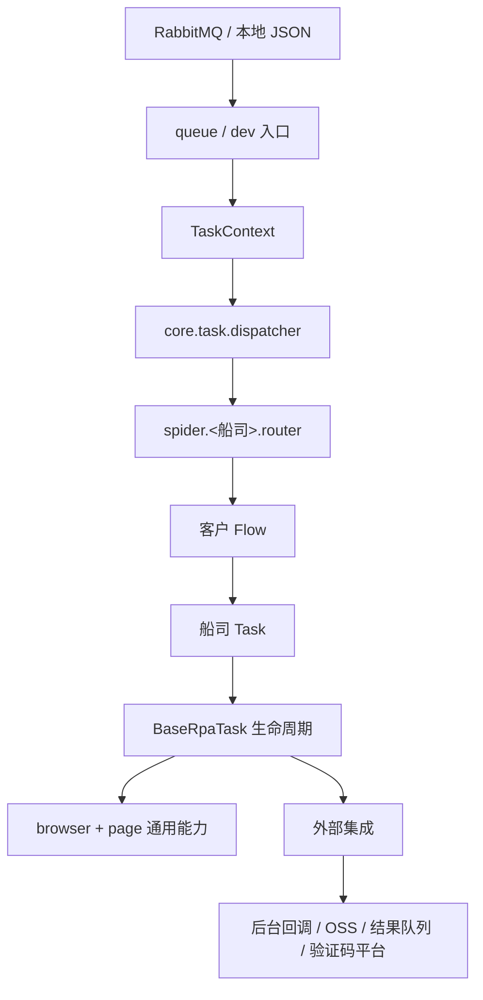
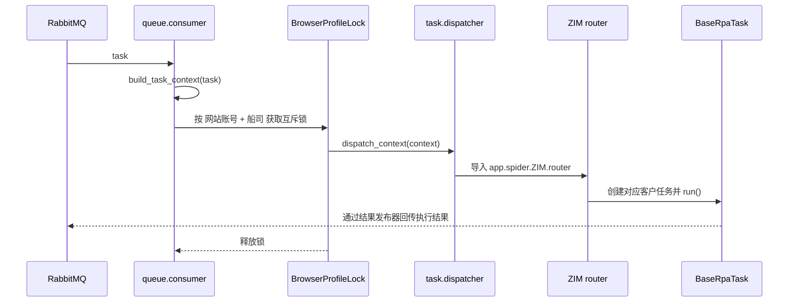

# Wise RPA 当前架构说明

> 本文以当前代码实现为准，描述 `wise-rpa` 的运行边界、模块职责和任务流。历史设计与现状不一致时，以本文件及代码为准。

## 1. 系统定位

`wise-rpa` 是一个面向船公司单证操作的 Python RPA Worker。它从 RabbitMQ 消费任务，依据队列名识别客户、船司与业务类型，路由到船司实现；任务使用 DrissionPage 接管或启动 Chromium，完成登录、查询、表单填写、字段校验，并向后台和结果队列回传执行状态及附件。

当前生产代码只包含 ZIM 船司适配，已注册的业务路由为：

| 队列名 | 客户 | 船司 | 业务 | 实际入口 |
| --- | --- | --- | --- | --- |
| `QTCT_ZIM_SI` | QTCT | ZIM | SI | `QtctZimSiTask` |
| `QTCT_ZIM_VGM` | QTCT | ZIM | VGM | `FlZimVGMTask` |

`RPA_QUEUES` 可以配置多个监听队列，但只有同时满足“船司目录存在”及“该船司 `router.py` 中有完整队列路由”的任务才能执行。

## 2. 技术组成

| 类别 | 组件 | 作用 |
| --- | --- | --- |
| 语言与运行时 | Python 3.12.12、uv | 项目运行与依赖管理。 |
| 消息队列 | RabbitMQ、funboost | 任务消费、结果回传和死信能力。 |
| 配置 | `.env`、python-dotenv、Nacos SDK、PyYAML | 加载本地环境与远端运行参数。 |
| 浏览器自动化 | DrissionPage / Chromium | 页面操作、网络监听、截图和录屏。 |
| 外部 HTTP | requests | 处理中通知、OSS 上传、验证码及钉钉告警。 |
| 媒体处理 | OpenCV、NumPy | 保留录屏帧合成 MP4 的能力。 |

## 3. 目录与分层

```text
.
├── app
│   ├── main.py                    # Queue Worker 入口
│   ├── config/                    # 环境、Nacos、RabbitMQ 和队列配置
│   ├── queue/                     # funboost 消费与结果发布适配
│   ├── core/
│   │   ├── task/                  # 上下文、分发、生命周期、结果与异常
│   │   ├── browser/               # Chromium 启动、端口、profile 与互斥锁
│   │   ├── page/                  # DOM、HTTP 监听、截图、录屏
│   │   ├── integrations/          # 后台通知、OSS、验证码、结果回传
│   │   └── logging/               # 控制台日志
│   ├── spider/ZIM/                # ZIM 船司实现
│   │   ├── common/                # 登录、订舱查询、选择器
│   │   ├── tasks/                 # SI / VGM 通用任务
│   │   ├── flows/                 # 客户任务入口与差异化配置
│   │   └── router.py              # 完整队列名到入口函数的映射
│   └── dev/                       # 本地 JSON 消息调试
├── doc/                           # 项目文档
├── mssage_list/                   # 本地任务消息样例
├── tests/                         # 当前单元测试
├── funboost_config.py             # funboost 连接配置
└── nb_log_config.py               # nb_log 日志配置
```

分层依赖方向如下：



`core` 提供可复用能力，不依赖任何具体船司；`spider` 只承载船司页面及客户差异；`queue` 负责接入 funboost，而不包含具体填单规则。

## 4. 启动与配置加载

### 4.1 入口

| 模式 | 入口 | 行为 |
| --- | --- | --- |
| 队列 Worker | `python -m app.main` | 读取 `RPA_QUEUES`，为每个队列创建 funboost 消费者。 |
| 本地调试 | `python -m app.dev.local_runner --message <JSON>` | 读取本地消息，关闭处理中通知、结果回传和录屏后执行真实路由。 |

### 4.2 配置初始化顺序

导入 `app.config` 的任意子模块时，包初始化会执行以下流程：

1. 从项目根目录加载 `.env`，且不覆盖已有进程环境变量。
2. 调用 `load_nacos_environment()` 拉取固定 Data ID 的 Nacos 配置。
3. 将验证码、钉钉及接口前缀等远端值写入进程环境变量。
4. `Settings.from_env()` 再读取队列及浏览器运行参数。

因此，当前的配置读取并非纯本地行为：即使启动本地调试，只要导入到 `app.config`，也会执行一次 Nacos 初始化。

### 4.3 当前生效的配置项

| 配置来源 | 关键项 | 使用位置 |
| --- | --- | --- |
| `.env` | `RPA_QUEUES` | Worker 需要监听的队列列表。 |
| `.env` | `BROWSER_PORT_START`、`BROWSER_PORT_END` | 浏览器 profile 的固定调试端口分配范围。 |
| `.env` | `DOWNLOAD_DIR`、`BROWSER_USER_DATA_DIR` | 下载文件、浏览器 profile、端口注册表与锁文件根目录。 |
| `.env` | `ENABLE_BROWSER` | 关闭时创建 `LocalPage`，不启动 Chromium。 |
| `.env` | RabbitMQ 地址、账号、虚拟主机 | 由 `funboost_config.py` 的 `RabbitmqSettings` 提供给 funboost。 |
| `.env` | `ENABLE_REMOTE_KILL_TASK` | 控制 funboost 是否支持远程终止任务。 |
| Nacos | 验证码账号、云码 Token、钉钉地址、接口前缀和请求头 | 写入环境变量后由集成模块读取。 |

`.env.example` 中还包含 `NACOS_ENABLED`、`NACOS_*` 等变量；当前 Nacos 加载函数使用的是小写的 `nacos_ip` 与 `nacos_namespace`，且未根据 `NACOS_ENABLED` 做开关判断。

## 5. 队列消息与路由

### 5.1 队列命名

输入队列名称必须满足以下格式：

```text
客户代码_船司代码_业务代码
```

解析时会统一转为大写，并且必须恰好为三段。例如 `QTCT_ZIM_SI` 会解析为 `customer_code=QTCT`、`carrier_code=ZIM`、`business_code=SI`。

### 5.2 最小消息协议

`build_task_context()` 当前强制校验以下字段：

| 路径 | 用途 | 是否必填 |
| --- | --- | --- |
| `rpaTaskTopic` | 队列名与业务路由依据 | 是 |
| `rpaMessageId` | 处理中通知及结果关联标识 | 是 |
| `id` | 结果消息中的任务 ID | 实际回传时必须有效 |
| `websiteInfo` | 网站登录信息与浏览器 profile 命名 | 是，且必须为对象 |
| `content` | 业务填单数据 | 是，且必须为对象 |

完整原始消息保存在 `TaskContext.task`。`content` 会深拷贝到 `TaskContext.remain_content`，后者用于跟踪尚未验证完成的字段。

### 5.3 消费与分发流程



每个配置队列使用一个 funboost consumer。默认消费参数为：单并发、`qps=1`、最大重试次数为 0；达到重试上限时启用死信队列投递。消费者在进入业务路由前，以浏览器 profile 为粒度获取同进程线程锁和同机文件锁，避免多个 Worker 同时操作同一网站账号的 Chromium 用户目录。

## 6. 通用任务生命周期

所有船司任务继承 `BaseRpaTask`。其当前运行顺序为：

1. 按 `TaskContext.enable_notify` 决定是否通知后台“处理中”。
2. 由 `BrowserManager` 创建或接管浏览器页面。
3. 创建 `DomHelper`、`HttpHelper`、`Screenshot`、OSS 客户端等任务级工具。
4. 执行船司 `login()`。
5. 执行具体业务的 `execute_business()`。
6. 成功时生成成功结果；异常时尝试截图并上传 OSS，提取异常中的业务错误码。
7. 按 `enable_result_publish` 决定是否发布 `TaskResult`。

`TaskResult` 对外包含任务 ID、是否成功、状态码、`rpaMessageId`、截图地址、录屏地址、说明和附件。结果发布器将其映射为文档更新队列的消息，并包装为：

```json
{
  "task": {
    "id": "<任务 ID>",
    "success": true,
    "code": 200,
    "rpaMessageId": "<消息 ID>"
  }
}
```

### 6.1 字段填写与校验

业务任务通过选择器定义 `(字段类型, 定位器, content 字段名, 显示名称)`，再调用基类的填写和校验方法。支持：

- `input`：输入文本；
- `select`：选择原生下拉选项；
- `s_select`：搜索并选择的自定义下拉框。

填写后不会立即从待校验数据中删除字段；读取页面值验证成功后，才会从 `remain_content` 删除该字段。任务末尾调用 `raise_if_unfilled_fields()`，会对未在忽略列表中的字段抛出 `UnfilledFieldError`。

## 7. 浏览器与页面能力

### 7.1 浏览器会话管理

浏览器 profile 名由 `websiteInfo.websiteUserName`（为空时使用 `websiteAccount`）和船司代码组成，例如 `<账号>_ZIM`。该标识同时决定：

- Chromium 用户目录；
- 固定调试端口；
- 同机任务互斥锁。

`BrowserPortRegistry` 会在 `BROWSER_USER_DATA_DIR/port_registry.json` 中持久化 profile 与端口的映射。`BrowserManager` 为每个任务配置下载目录、默认 Chromium 参数、下载偏好及无痕/页面加载等待选项。

启用真实浏览器时，项目通过 DrissionPage 的内部启动钩子使新建 Chromium 脱离 Worker 进程树；任务结束时浏览器会保留，以便后续相同 profile 接管复用。关闭 `ENABLE_BROWSER` 时会返回仅实现 `ele()` / `eles()` 的 `LocalPage`，可用于部分非浏览器级流程，但 ZIM 登录会检测页面能力并拒绝运行。

### 7.2 页面工具

| 模块 | 能力 |
| --- | --- |
| `DomHelper` | 元素查找、点击、批量点击、输入、原生/搜索下拉、取文本和值、进入 iframe。元素缺失时统一抛出 `ElementNotFoundError`。 |
| `HttpHelper` | 启动 DrissionPage 网络监听，在触发页面操作后等待指定接口响应。 |
| `Screenshot` | 页面或元素截图，默认在 `runtime/screenshots` 下生成文件，失败时最多重试 3 次。 |
| `Recorder` | 封装 DrissionPage screencast 和可选的帧转 MP4 能力。当前未接入 `BaseRpaTask.run()`。 |
| `wait.py` | 提供简单秒级等待封装。 |

## 8. ZIM 船司实现

### 8.1 船司公共能力

`ZimBaseTask` 实现 ZIM 站点的公共流程：

- 校验当前页面具备真实浏览器所需的页面与 Session 方法；
- 进入站点首页并判断现有会话是否可用；
- 获取 hCaptcha 识别结果，使用 Session 模式提交登录请求并回写 Cookie；
- 检测站点“系统异常”提示并最多刷新 3 次；
- 通过页面网络监听进入订舱列表、按提单号查询并校验唯一结果。

当前登录请求的数据源尚未完全由 `websiteInfo` 驱动：代码中使用了固定的登录凭据，而不是使用消息携带的账号密码。

### 8.2 SI 流程

`ZimSiTask` 的执行逻辑为：查询订舱、打开提单确认页、填写基础字段、重建并填写箱货字段、读取页面值进行校验、检查未完成字段、读取官网错误提示，并生成页面截图作为草稿附件。

SI 的保存按钮及保存接口监听目前处于注释状态，因此当前实现完成的是页面填写与校验，不会执行官网保存或提交。

### 8.3 VGM 流程

`ZimVGMTask` 的执行逻辑为：查询订舱、进入订舱列表 iframe、打开 VGM 弹窗 iframe、重建并填写箱货、填写联系人信息、校验字段并检查漏填。

VGM 的 Submit 按钮调用目前处于注释状态，因此当前实现同样不会提交官网表单。

### 8.4 客户扩展点

客户差异位于 `app/spider/ZIM/flows/qtct_zim.py`。客户类可以继承 `ZimSiTask` 或 `ZimVGMTask`，覆盖浏览器选项、忽略字段、登录或业务步骤；再将入口函数加入 `app/spider/ZIM/router.py` 的 `ROUTES` 映射即可启用完整队列路由。

## 9. 外部集成与运行产物

| 集成 | 当前职责 | 输出或目的地 |
| --- | --- | --- |
| `ProcessingNotifier` | 在任务开始时回调后台处理状态 | 后台 RPA 消息回调接口。 |
| `ResultPublisher` | 构造任务结果并用 funboost 发布 | `gcp_document_update` 队列。 |
| `OssClient` | 上传截图、附件及录屏文件；上传成功后删除本地文件 | 固定文件上传接口。 |
| `captcha.py` | 图鉴、云码和 hCaptcha 识别，失败时发送钉钉告警 | 第三方验证码平台、钉钉机器人。 |
| `logger.py` | 输出带时间、调用位置和级别的控制台日志 | 标准输出。 |

运行期间会产生以下本地数据：

| 路径 | 内容 |
| --- | --- |
| `runtime/browser_profiles/<profile>/` | Chromium 用户目录与 profile 数据。 |
| `runtime/browser_profiles/port_registry.json` | 浏览器 profile 与固定端口映射。 |
| `runtime/browser_profiles/.locks/` | 同机浏览器会话锁文件。 |
| `runtime/downloads/<queue>/` | 按队列划分的下载文件。 |
| `runtime/screenshots/` | 页面及元素截图。 |
| `runtime/records/` | 录屏输出目录。 |
| `runtime/task_messages/<queue>/` | 供 `save_task_message()` 使用的消息归档目录；当前消费流程未调用该函数。 |
| `runtime/logs/` | nb_log 配置定义的日志目录。 |

## 10. 已实现边界

| 能力 | 当前状态 |
| --- | --- |
| RabbitMQ 多队列消费 | 已实现，入口由 `RPA_QUEUES` 控制。 |
| 完整队列名动态路由 | 已实现，当前仅有 ZIM 的两条 QTCT 路由。 |
| 任务上下文、异常码、字段漏填校验 | 已实现。 |
| 同一网站账号的浏览器会话互斥 | 已实现，覆盖同进程与同机多进程。 |
| ZIM 登录、订舱查询、SI/VGM 页面填写与校验 | 已实现代码路径，依赖真实浏览器、外部验证码服务和目标网站可用。 |
| ZIM SI 保存/提交与 ZIM VGM 提交 | 当前未接入，相关调用处于注释状态。 |
| 录屏与录屏结果回传 | 有独立实现，当前任务生命周期未启用。 |
| 任务原始消息落盘 | 有工具函数，当前消费者未调用。 |
| WHL 等其他船司实现 | 当前代码树中未保留。 |

## 11. 验证入口

```bash
# 运行现有单元测试
uv run python -m unittest discover -s tests -v

# 使用本地消息样例调试
uv run python -m app.dev.local_runner --message mssage_list/msg_demo.json

# 启动队列 Worker
uv run python -m app.main
```

执行真实 ZIM 流程时，除需要可用的 RabbitMQ 或本地消息外，还需要 Nacos、验证码服务、OSS、后台回调及可访问的 Chromium 和 ZIM 站点；本地调试入口虽然关闭了通知和结果回传，但不会绕过 ZIM 对真实浏览器的要求。
