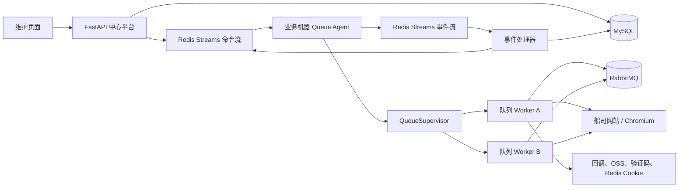
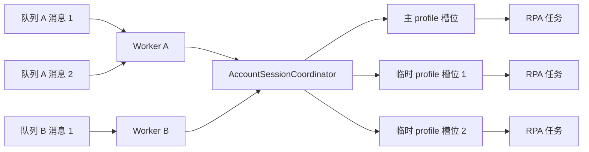
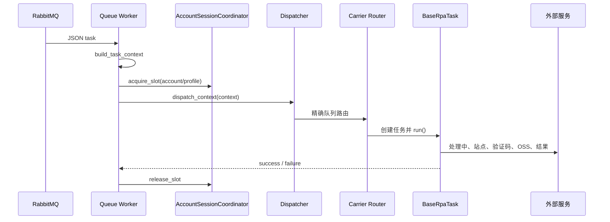

# Wise RPA 架构说明

> 版本：基于当前代码树整理，2026-08-07。本文以实现为准，描述已接入的运行链路；未接入或受运行环境限制的能力会明确标注。

## 1. 系统概览

`wise-rpa` 是面向船公司单证操作的分布式 Python RPA 系统。系统由**中心队列控制平台**和部署在业务机器上的**设备侧 Queue Agent**组成。中心平台统一维护设备、队列分配与命令审计；Agent 将控制命令转换为本机 Worker 生命周期操作；Worker 从 RabbitMQ 消费业务消息，启动或复用 Chromium 会话，执行船司页面自动化，并回传结果和运行产物。

当前已注册的业务路由只有 ZIM：

| 业务队列 | 客户 | 船司 | 业务 | 入口 |
| --- | --- | --- | --- | --- |
| `QTCT_ZIM_SI` | QTCT | ZIM | SI | `QtctZimSiTask` |
| `QTCT_ZIM_VGM` | QTCT | ZIM | VGM | `FlZimVGMTask` |

系统的关键边界如下：

| 边界 | 系统职责 | 不负责的内容 |
| --- | --- | --- |
| 中心控制平台 | 设备注册、队列唯一分配、期望状态、命令审计、状态快照 | 执行 RabbitMQ 业务消息和浏览器自动化 |
| 设备侧 Agent | Redis 命令消费、Worker 监管、状态/心跳上报、设备内账号会话协调 | 提供 HTTP 管理 API 或持久化中心数据 |
| 队列 Worker | 单队列 RabbitMQ 消费、业务路由、RPA 生命周期 | 管理其他队列或跨设备调度 |
| 船司适配 | 登录、查询、字段填写、网页校验及提交动作 | 队列基础设施和设备控制协议 |



## 2. 技术组成与外部依赖

| 类别 | 实现 | 用途 |
| --- | --- | --- |
| 语言与依赖管理 | Python 3.12.12、uv | Worker、中心服务和开发环境。 |
| HTTP 服务 | FastAPI、Uvicorn、Jinja2 | 中心控制平台 API 与维护页面。 |
| 消息处理 | RabbitMQ、funboost、amqpstorm | RPA 任务消费、结果发布和死信投递。 |
| 控制通道 | Redis Streams | 中心到设备的命令、设备到中心的心跳/状态/命令结果。 |
| 中心状态库 | MySQL、PyMySQL | 设备、分配、命令、状态和事件审计。 |
| 配置 | `.env`、python-dotenv、Nacos、PyYAML | 本地设备配置及远端业务基础配置。 |
| 浏览器自动化 | DrissionPage / Chromium | 页面操作、网络监听、Cookie 和下载。 |
| 运行产物 | CaptureSDK、OpenCV、NumPy | Windows 录屏及媒体处理支持。 |
| 外部服务 | `requests`、wise-utils | 后台处理中回调、结果队列、OSS、验证码、Cookie Redis、钉钉告警。 |

依赖存在三个互不替代的存储/消息用途：RabbitMQ 承载业务任务；Redis Streams 承载控制协议；业务 Redis 保存 ZIM Cookie 等运行数据。中心 MySQL 只保存控制平台的事实与审计，不存业务表单数据。

## 3. 代码组织

```text
.
├── app/
│   ├── main.py                         # 设备 Agent 入口
│   ├── control/
│   │   ├── queue_client/               # Redis 控制协议客户端
│   │   ├── supervisor.py               # 每队列独立 Worker 的生命周期监管
│   │   └── worker.py                   # 单个 Worker 子进程入口与排空协作
│   ├── config/                         # .env、Nacos、RabbitMQ、运行参数
│   ├── queue/                          # 任务上下文、消费者、可排空 RabbitMQ 适配
│   ├── core/
│   │   ├── task/                       # 路由、上下文、任务生命周期、结果和错误
│   │   ├── scheduler/                  # 设备内账号会话/浏览器槽位协调
│   │   ├── browser/                    # profile、端口、启动和会话工具
│   │   ├── page/                       # DOM、网络监听、截图和录屏
│   │   ├── integrations/               # 回调、结果、OSS、验证码、Cookie Redis
│   │   └── logging/                    # 日志
│   ├── spider/ZIM/                     # ZIM 站点及 QTCT 客户差异
│   └── dev/                            # 本地 JSON 消息调试
├── queue_control_platform/
│   ├── server/                         # FastAPI、MySQL 仓储、Redis 总线、事件处理
│   ├── frontend/                       # 维护页面静态资源和模板
│   └── docker/                         # 本地 MySQL / Redis Compose
├── tests/                              # 生命周期、控制协议、账号会话等单元测试
├── doc/                                # 项目文档
├── funboost_config.py                  # funboost 连接配置
└── pyproject.toml                      # Python 依赖与测试配置
```

依赖方向是 `控制/队列接入 -> core.task -> spider`，其中 `core` 不应依赖具体船司；`spider` 只承载站点和客户规则；控制平台与业务 Worker 通过 Redis Streams 协作，不直接互相导入。

## 4. 运行单元和启动方式

| 单元 | 入口 | 常驻职责 |
| --- | --- | --- |
| 中心控制平台 | `uv run python -m queue_control_platform.server.main` | 启动 FastAPI；在 lifespan 内启动 Redis 事件处理器。 |
| 设备 Queue Agent | `uv run python -m app.main` | 接收 Redis 命令、创建本机账号协调器、监管队列 Worker。 |
| 队列 Worker | 由 `QueueSupervisor` 以 `multiprocessing spawn` 创建 | 建立指定 RabbitMQ 队列订阅，执行任务并响应本地排空命令。 |
| 本地调试 | `uv run python -m app.dev.local_runner --message <JSON>` | 读取本地消息，关闭处理中通知、结果回传和录屏，仍走真实业务路由。 |

Agent 启动时不会通过 `RPA_QUEUES` 自动决定消费范围。队列范围以中心 `queue_assignments` 为准；Worker 只有在收到 `assign` 或 `sync` 后才会启动。`app.queue.consumer.start_consumers()` 仍保留为兼容入口，但正式设备入口不使用它。

## 5. 配置加载与运行参数

### 5.1 初始化顺序

导入 `app.config` 时会执行一次初始化：

1. 从项目根目录加载 `.env`，不覆盖已有进程环境变量。
2. 当 `NACOS_ENABLED` 未被显式设置为 `0`、`false`、`no` 或 `off` 时，读取 Nacos 并写入验证码、钉钉等环境变量。
3. 运行时由 `Settings.from_env()` 读取浏览器、消费并发与账号并发参数。
4. RabbitMQ 连接参数由现有 Nacos 数据源配置按 `APP_ENV` 选择。

因此，生产 Agent 和 Worker 依赖可访问的 Nacos（除非关闭）；控制 Redis 与业务 Cookie Redis 是不同用途，不能因地址相同而混为一个协议。

### 5.2 关键配置

| 配置 | 作用 | 默认或约束 |
| --- | --- | --- |
| `QUEUE_CONTROL_DEVICE_ID` / `QUEUE_CONTROL_DEVICE_TOKEN` | 设备身份和平台注册令牌 | Agent 必填。 |
| `QUEUE_CONTROL_REDIS_URL` | Redis Streams 控制总线 | 默认本机 6379/0。 |
| `QUEUE_CONTROL_MYSQL_URL` | 中心控制平台 MySQL | 中心服务必填。 |
| `CONTROL_DRAIN_TIMEOUT_SECONDS` | 协作式排空超时阈值 | 默认 1800 秒。 |
| `BROWSER_PORT_START` / `BROWSER_PORT_END` | 浏览器 profile 固定端口范围 | 默认 10000-48000。 |
| `BROWSER_USER_DATA_DIR` | 主 profile、端口注册表和临时 profile 根目录 | 默认 `runtime/browser_profiles`。 |
| `DOWNLOAD_DIR` | 浏览器下载目录根路径 | 默认 `runtime/downloads`。 |
| `QUEUE_CONCURRENT_NUM` / `QUEUE_QPS` | 单 Worker 的 funboost 并发与速率 | 默认 3 / 3。 |
| `ACCOUNT_MAX_CONCURRENT` | 同一账号的最大浏览器槽位数 | 默认 3。 |
| `ACCOUNT_IDLE_SECONDS` | 临时账号槽位的空闲回收时间 | 默认 60 秒。 |
| `NACOS_ENABLED` | 是否禁用 Nacos 载入 | 默认启用。 |

## 6. 中心控制平台

### 6.1 组成与数据模型

中心平台由 `queue_control_platform/server` 提供，维护页面通过 FastAPI 调用 API，页面状态从 MySQL 快照获取而非直接探测业务机器。

| 表 | 关键数据 | 用途 |
| --- | --- | --- |
| `devices` | 设备 ID、令牌摘要、在线状态、最后心跳 | 注册与在线判断。 |
| `queue_assignments` | 队列名、设备 ID、期望状态、版本 | 队列唯一归属和恢复依据。 |
| `queue_statuses` | 实际状态、PID、错误、时间 | 保存 Agent 最后一次全量上报。 |
| `queue_commands` | 命令、参数、执行状态、错误、确认时间 | 页面命令审计和执行结果。 |
| `queue_events` | Redis 事件 ID、设备、类型和载荷 | 事件去重与历史记录。 |

同一 `queue_name` 在 `queue_assignments` 中是主键，因此一个业务队列只能绑定一台设备。`assignment_version` 随分配变更递增并写入 `assign` 命令，供审计和后续协议扩展使用；当前设备 Agent 的 `assign` 处理尚未读取该版本，因此不能将它视为已实现的命令防重放机制。

### 6.2 API 与命令

| API | 行为 | 返回语义 |
| --- | --- | --- |
| `GET /api/dashboard` | 返回设备、分配和状态快照 | 非实时进程探测。 |
| `POST /api/devices` | 创建设备并返回一次性注册令牌 | `201` 表示注册信息已写入。 |
| `POST /api/devices/{id}/queues` | 分配队列并写入 `assign` 命令 | `202` 表示命令已接受。 |
| `DELETE /api/devices/{id}/queues/{queue}` | 写入 `unassign` 命令后解除中心分配 | `202` 不代表 Worker 已退出。 |
| `POST /api/devices/{id}/queues/{queue}/commands` | `pause`、`resume`、`restart` | `202` 后以状态/命令结果确认。 |
| `POST /api/devices/{id}/commands/restart-all` | 重启设备所有当前队列 | `202` 后异步执行。 |

### 6.3 Redis Streams 协议

| 流 | 生产者 | 消费者 | 内容 |
| --- | --- | --- | --- |
| `queue-control:commands:<DEVICE_ID>` | 中心平台 | 对应设备 Agent | `assign`、`sync`、`unassign`、`pause`、`resume`、`restart`、`restart_all`。 |
| `queue-control:events` | 设备 Agent | 中心事件处理器 | `heartbeat`、`status`、`command_result`。 |

两个方向都使用消费组确认。读取方先以 `XAUTOCLAIM` 认领超过 5 秒未确认的 Pending 消息，成功处理后再 `XACK`，因此协议是**至少一次投递**。中心依靠事件 ID、命令记录和数据表约束抑制重复；业务动作自身仍须以 `rpaMessageId` 等上游标识保障幂等性。

设备每 15 秒发送一次心跳，启动时会立刻发送。中心在接受有效 `heartbeat` 后查询该设备的完整 `queue_assignments`，发送 `sync` 快照。这使设备重启不依赖旧 `assign` 命令重放即可恢复队列及暂停意图。

## 7. 设备侧队列管理

### 7.1 Agent 与 Supervisor

`QueueControlClient` 启动一个 `QueueSupervisor` 与一个 `multiprocessing.Manager` 承载的 `AccountSessionCoordinator`。Agent 将命令映射为 Supervisor 操作，并在操作成功或失败后回传 `command_result`；无论操作结果如何，当前实现都会确认已读取的命令，以避免错误命令永久阻塞命令流。

| 命令 | Supervisor 行为 |
| --- | --- |
| `assign` | 登记队列，按期望状态启动 Worker。 |
| `sync` | 以中心完整快照新增、暂停、恢复或解除本机队列。 |
| `unassign` | 排空并停止 Worker，移除本机运行时。 |
| `pause` | 停止拉取新消息，等待已接收任务完成后退出。 |
| `resume` | 新建 Worker 重新监听。 |
| `restart` | 正常排空后重建 Worker；`forceRestart=true` 时直接终止旧进程。 |
| `restart_all` | 对 Agent 当前全部队列执行重启。 |

每个队列在独立 `spawn` 子进程中运行，因而重启 Worker 会重新导入业务代码和 RabbitMQ 配置。Supervisor 会监控子进程、整理崩溃进程遗留的账号槽位、持久化本机状态（正式 Agent 模式关闭该本地持久化，以中心 `sync` 为准）并上报完整状态快照。

### 7.2 排空、暂停和故障语义

`PausableRabbitmqConsumer` 在收到排空请求后停止 RabbitMQ 投递，等待已经交给 funboost 的任务完成 ACK/NACK。排空期间新到但未提交的消息会 `nack(requeue=True)` 回队列；当前 prefetch 与队列并发参数绑定，Worker 不保证“恰好一次”。

| 状态 | 含义 |
| --- | --- |
| `STARTING` | Worker 已创建，尚未完成 RabbitMQ 订阅。 |
| `RUNNING` | 已建立订阅，正在接收任务。 |
| `DRAINING` | 已停止接收新任务，等待已接收任务完成。 |
| `PAUSED` | Worker 已退出且保持暂停意图。 |
| `RESTARTING` | 正在替换 Worker。 |
| `FAILED` | Worker 启动或运行失败。 |
| `UNREPORTED` | 中心未在最新快照中看到历史状态，旧 PID 不可信。 |

正常暂停和重启不会主动杀死正在执行的 RPA；超时会被记录为 `drain_timeout`，Worker 仍继续等待。强制重启会终止 Worker，可能使 RabbitMQ 重新投递消息，外部提交类流程必须承受重复执行风险。

## 8. 账号会话与浏览器资源

任务按 `websiteInfo.id`（为空则使用 `default`）与船司构成账号键和主 profile 名，例如 `1001_ZIM`。网站账号密码仍来自 `websiteInfo.websiteAccount` 和 `websitePassword`；当前账号会话的并发隔离键并不使用这两个字段。Agent 级 `AccountSessionCoordinator` 通过 Manager 共享给所有队列 Worker，协调同一账号键的浏览器资源：

1. 首个任务独占持久化主 profile，并作为登录引导者。
2. 登录成功后，后续任务可占用主 profile 或临时 profile，最多到 `ACCOUNT_MAX_CONCURRENT`。
3. 发生凭据登录时，只选举一个任务提交账号密码；等待任务检测到新的登录代次后复用 Cookie，避免重复登录。
4. 临时 profile 位于 `.ephemeral`，空闲超过 `ACCOUNT_IDLE_SECONDS` 后关闭浏览器、释放端口并删除目录；主 profile 会保留。

`BrowserPortRegistry` 将 profile 到调试端口的映射保存到 `port_registry.json`。Worker 崩溃或被强制终止时，Supervisor 会释放该 Worker 名下的租约。旧 `BrowserProfileLock` 实现仍保留在代码和测试中，但正式任务路径已使用账号会话协调器，不再用单一 profile 的互斥锁串行化所有同账号任务。

### 8.1 同账号、多消息并发处理设计

同一账号键的多条消息可以来自同一个 RabbitMQ 队列，也可以来自该设备上不同的队列 Worker。它们不会直接共用同一个 Chromium 用户目录：任务必须先向 Agent 级协调器申请浏览器槽位，再开始业务路由和页面操作。



并发控制分为三个层次：

| 层次 | 控制对象 | 当前实现 | 默认上限 |
| --- | --- | --- | --- |
| 队列进程 | 已分配业务队列 | 每个队列一个独立 `spawn` Worker | 由中心队列分配决定。 |
| 队列消息 | 单个 Worker 的任务和未确认消息 | funboost `concurrent_num` 与 AMQP QoS 都使用 `QUEUE_CONCURRENT_NUM` | 3。 |
| 同账号键 | 跨所有本机 Worker 的浏览器操作 | `AccountSessionCoordinator` 租约 | `ACCOUNT_MAX_CONCURRENT`，默认 3。 |

因此，当同一账号键的消息数不超过 `ACCOUNT_MAX_CONCURRENT` 时，首条消息使用持久化主 profile，后续消息使用协调器分配的临时 profile，可并行执行页面操作。当该账号键的所有槽位都被占用时，后续消息会阻塞在 `acquire_slot()`，不会额外启动浏览器，也不会与已有任务并发接管同一个 profile。

消息在等待槽位期间已经被 RabbitMQ 投递，并已占用所在队列的 funboost 执行槽位和 QoS 未确认消息窗口。这是有意的背压：它将同账号浏览器并发限制在账号层，但会使热点账号消息占满单队列的可用并发，进而延迟该队列中其他账号的消息。

### 8.2 登录、Cookie 与并发安全

同账号并发不代表允许同时提交登录凭据。协调器使用登录代次和领导者选举保证：

1. 首个使用该账号键的任务独占主 profile，负责初始登录。
2. 登录成功后，协调器将会话标记为可用，其他槽位任务可开始运行。
3. 若多个任务发现 Cookie/会话失效，只有一个任务能取得凭据登录领导权并提交验证码和账号密码。
4. 其余任务等待新的 `login_generation`，随后重新读取 Redis Cookie 并尝试复用会话。

该设计避免同一设备内重复提交验证码、账号密码和 Cookie 刷新。它的范围仅限一台设备：中心平台按队列分配，不按账号分配；同一账号键若被不同设备上的队列使用，当前没有跨设备的分布式账号租约，仍可能并发登录。

### 8.3 容量边界与示例

设单设备有 `Q` 个运行队列，`N=QUEUE_CONCURRENT_NUM`，`A=ACCOUNT_MAX_CONCURRENT`，单任务平均完成 ACK/NACK 的耗时为 `T` 秒：

| 指标 | 上限或估算 | 说明 |
| --- | --- | --- |
| 单队列在途消息 | `N` | QoS 与 funboost 槽位均以 `N` 配置。 |
| 单设备在途消息 | `Q * N` | 所有队列均处于健康消费状态时的理论上限。 |
| 单账号键浏览器并发 | `A` | 跨本机所有队列共享。 |
| 单账号键稳定吞吐 | 近似 `A / T` | 还受网站限流、验证码和页面耗时限制。 |

例如，设备有 4 个队列，且 `N=3`、`A=3`，则设备最多会持有约 12 条 RabbitMQ 在途消息。若这 12 条消息全部属于相同账号键，最多只有 3 条能并行操作浏览器，剩余消息将在各自 Worker 中等待账号槽位。此时单纯提高 `QUEUE_CONCURRENT_NUM` 不会提升该账号吞吐，反而会增大未确认消息数和暂停排空时间。

### 8.4 释放、排空与异常

业务任务在 `handle_message()` 的 `finally` 中释放账号槽位；Worker 异常退出或被强制终止时，Supervisor 会释放该进程名下遗留的租约。临时 profile 在账号空闲超过 `ACCOUNT_IDLE_SECONDS` 后关闭浏览器、释放端口并删除目录，主 profile 会保留以复用会话。

暂停和正常重启会停止新的 RabbitMQ 投递，但已取得消息仍可能在等待账号槽位或执行浏览器操作，Worker 会等待它们完成 ACK/NACK。强制重启会中断这些任务并可能造成消息重投；有站点保存或提交副作用的业务必须按照 `rpaMessageId` 与站点当前状态实现幂等判断。

完整的队列级 QoS、吞吐模型、热点账号阻塞和监控指标见 [队列消息并发架构说明](队列消息并发架构说明.md)。

## 9. RabbitMQ 业务处理与路由

### 9.1 消息协议

消费者从 RabbitMQ 获取 JSON 任务后，`build_task_context()` 要求：

| 字段 | 要求 | 用途 |
| --- | --- | --- |
| `rpaTaskTopic` | 必填字符串 | 完整队列名和路由查找依据。 |
| `rpaMessageId` | 必填字符串 | 处理中通知、结果关联。 |
| `id` | 结果回传时应有效 | 任务业务 ID。 |
| `websiteInfo` | 必填对象 | 网站账号、密码和浏览器账号键。 |
| `content` | 必填对象 | 业务字段。 |

`content` 会深拷贝为 `remain_content`。每个字段必须在页面验证成功后才从该副本移除，任务末尾可据此发现漏填字段。

### 9.2 动态路由与执行序列

路由不解析队列名中下划线的位置，而是在所有 `app/spider/<carrier>/router.py` 的 `ROUTES` 中按完整、标准化后的队列名查找。找不到或多个船司重复注册都会抛出 `RouteNotFoundError`。



当前 `RpaBoosterParams` 使用 RabbitMQ amqpstorm 消费器、持久队列、被动声明和死信交换机；最大重试次数为 0，达到上限时交由死信队列。实际并发和 QPS 由环境变量传入，而非旧版固定单并发。

## 10. 任务生命周期和结果

所有业务任务继承 `BaseRpaTask`，其顺序为：

1. 需要时通知后台任务进入处理中。
2. 根据账号租约启动或接管 Chromium，并创建 DOM、HTTP 监听、截图和 OSS 工具。
3. 执行船司登录，并向账号协调器报告登录完成状态。
4. Windows 且启用结果回传时，若任务设置 `enable_record=True`，登录成功后尝试启动录屏；录屏失败不阻断业务。
5. 执行具体船司业务。
6. 失败时尽力截图并上传 OSS；结束时停止录屏、上传视频和草稿附件。
7. 需要时发布 `TaskResult`。结果发布失败会转换为 `ResultPublishError`。

结果包含任务 ID、成功状态、错误码、`rpaMessageId`、失败截图、录屏文件、说明和附件。发布器将结果包装到 `gcp_document_update` 队列的 `task` 载荷中；处理中通知通过后台回调接口发送。业务 Cookie 以 `cookies:zim_<websiteAccount>` 存在 Redis DB 15。

## 11. ZIM 适配现状

### 11.1 通用登录与查询

`ZimBaseTask` 使用消息中的 `websiteInfo.websiteAccount` 与 `websitePassword` 登录：优先检查现有页面会话，再加载 Redis Cookie，最后在账号协调器选举下提交 hCaptcha 登录。登录成功后保存 Cookie。站点系统异常最多刷新三次；订舱查询使用网络监听，要求查询结果唯一且与提单号一致。

### 11.2 业务能力

| 业务 | 已实现路径 | 当前边界 |
| --- | --- | --- |
| ZIM SI | 查询订舱、打开确认页、填写基础字段和箱货、页面回读校验、漏填校验、点击保存、监听保存接口、官网错误提示检查、截图作为草稿附件 | 是否最终提交取决于站点“保存”语义；代码未实现额外提交步骤。 |
| ZIM VGM | 查询订舱、进入列表/弹窗 iframe、填写箱货和联系人字段、页面回读校验、漏填校验 | `VGM_SUBMIT_BTN` 调用仍被注释，当前不会提交。 |

客户差异集中在 `app/spider/ZIM/flows/qtct_zim.py`。新增船司或客户时，应在目标船司提供 `router.py`、以 `CarrierRoute` 登记完整队列名、实现 `dispatch(context)`，并在中心分配前验证其路由可解析。

## 12. 本地运行产物与运维要求

| 路径 | 内容 |
| --- | --- |
| `runtime/browser_profiles/<profile>/` | 持久化 Chromium 用户数据。 |
| `runtime/browser_profiles/.ephemeral/` | 可回收的并行临时 profile。 |
| `runtime/browser_profiles/port_registry.json` | profile 与调试端口映射。 |
| `runtime/downloads/<queue>/` | 队列维度下载文件。 |
| `runtime/screenshots/` | 页面和元素截图。 |
| `runtime/records/` | Windows 录屏输出。 |
| `runtime/control/state.json` | 独立 Supervisor 模式的本机状态；正式 Agent 模式不作为恢复来源。 |
| `runtime/task_messages/<queue>/` | `save_task_message()` 的可选消息归档；正式消费链路当前未调用。 |

线上部署至少需要分别守护中心平台与每台机器的 `app.main`。中心平台、业务机器应使用同一个控制 Redis 与 MySQL；所有设备 ID 必须唯一。RabbitMQ、Nacos、目标站点、验证码、OSS、后台回调及业务 Redis 还必须按环境分别可达。

## 13. 验证与已知限制

建议的基础验证：

```bash
uv run python -m unittest discover -s tests -v
uv run python -m app.dev.local_runner --message mssage_list/msg_demo.json
uv run python -m queue_control_platform.server.main
uv run python -m app.main
```

当前限制与风险：

| 项目 | 说明 |
| --- | --- |
| 投递语义 | 控制命令、状态事件和 RabbitMQ 业务消费都不能假设恰好一次。 |
| 强制重启 | 会中断业务执行，可能造成消息重投和站点操作重复。 |
| 分配版本 | 中心会生成 `assignmentVersion`，但当前 Agent 不校验该字段；历史 `assign` 命令仍应依赖完整 `sync` 快照校正。 |
| 状态实时性 | 页面显示 MySQL 最后快照；设备离线阈值和状态上报有时间差。 |
| 录屏平台 | 仅 Windows、`enable_record=True` 且结果回传开启时尝试；失败不会阻断任务。 |
| 船司覆盖 | 当前仅注册两个 ZIM 队列。 |
| ZIM VGM | 页面填写和校验完成，但未点击提交。 |
| 消息归档 | 有工具函数，无正式消费链路调用。 |
| 真实调试 | 本地调试关闭外部回传，但不会模拟 ZIM 浏览器、验证码或网站行为。 |
