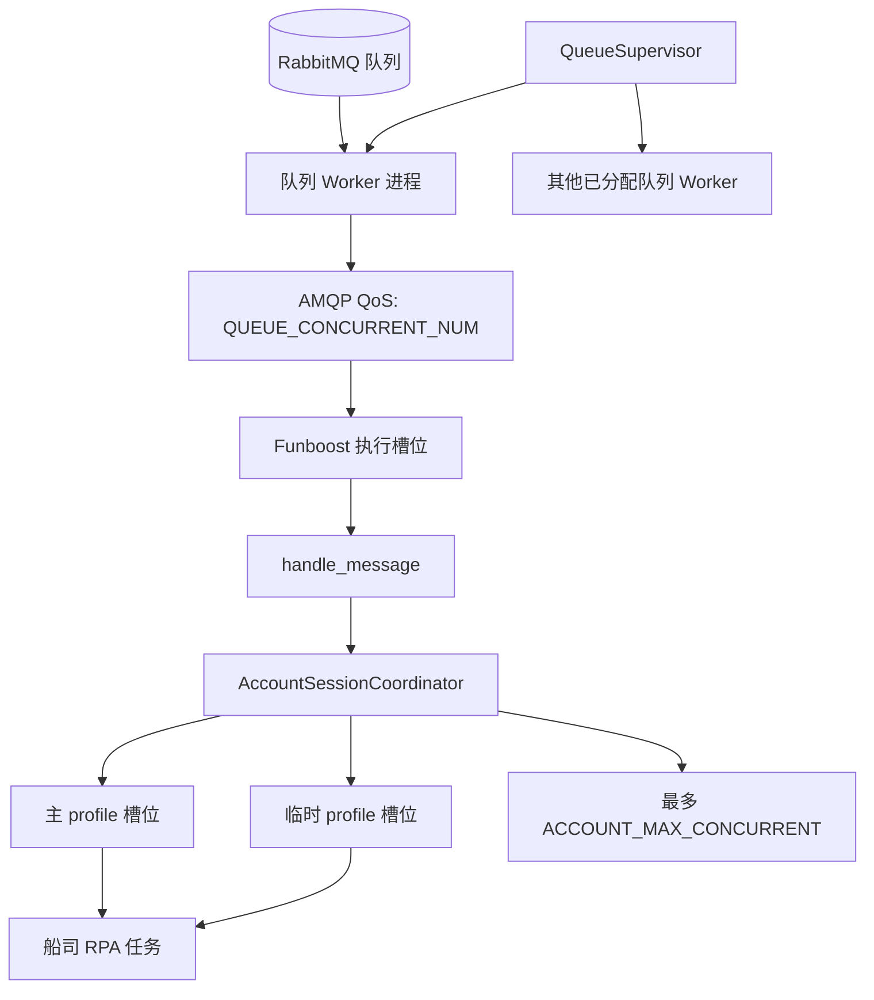
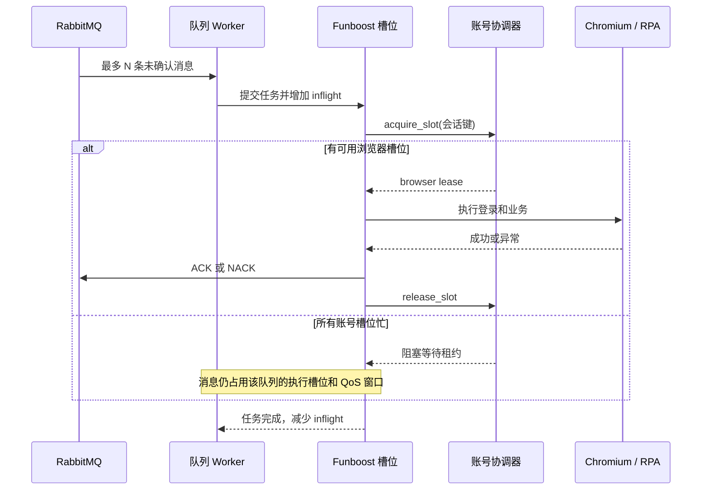

# Wise RPA 队列消息并发架构说明

> 版本：基于当前代码树整理，2026-08-07。本说明聚焦 RabbitMQ 任务从取消息到浏览器执行的并发边界、生命周期和容量配置。

## 1. 设计目标

队列消息并发设计需要同时满足以下目标：

1. 不同业务队列可以由独立 Worker 并行消费，避免一个队列故障阻塞其他队列。
2. 单队列可通过配置提高吞吐，但不在暂停或重启时丢弃已经取得的消息。
3. 同一网站会话键跨队列共享并发上限，避免多个 Chromium 操作同一持久 profile 或同时重复登录。
4. 控制层、业务层和浏览器层均接受至少一次语义，外部提交必须具备幂等保护。

## 2. 并发层次



| 层次 | 并发单位 | 限制参数 | 作用域 | 主要职责 |
| --- | --- | --- | --- | --- |
| 设备/队列 | 一个 RabbitMQ 队列一个 Worker 进程 | 中心 `queue_assignments` | 单台业务机器 | 隔离队列生命周期和故障。 |
| 单队列消息 | Funboost 执行槽位 | `QUEUE_CONCURRENT_NUM` | 一个 Worker 进程 | 限制该队列同时执行的任务数。 |
| 单队列取消息 | RabbitMQ 未确认消息窗口 | AMQP QoS 设置为 `QUEUE_CONCURRENT_NUM` | 一个 AMQP 通道 | 限制 Worker 同时持有的未确认消息。 |
| 单队列速率 | 任务启动速率 | `QUEUE_QPS` | 一个 Worker 进程 | 平滑启动速率，不等同于执行中任务数上限。 |
| 同会话键 | 浏览器槽位租约 | `ACCOUNT_MAX_CONCURRENT` | 同一 Agent 的所有 Worker | 限制同一 `websiteInfo.id + carrier_code` 的并发 RPA。 |
| 浏览器实例 | 持久主 profile 或临时 profile | 租约分配 | 单台业务机器 | 隔离浏览器用户目录、端口与登录生命周期。 |

## 3. 队列 Worker 并发模型

### 3.1 一个队列一个进程

中心平台将队列分配给设备后，设备侧 `QueueSupervisor` 使用 `multiprocessing spawn` 为每个队列创建一个独立 Worker。每个 Worker 独立建立 RabbitMQ 连接、加载业务路由与配置，并只消费自己的队列。

这意味着：

- 队列 A 的页面异常、排空或重启不会直接停止队列 B。
- 同一设备可同时运行多个队列；队列数量由中心分配决定，不由 `RPA_QUEUES` 启动参数决定。
- Worker 重启会重新导入 Python 业务代码，但不会重置 Agent 中由 Manager 承载的账号会话协调器。

### 3.2 单队列槽位与 QoS

`create_queue_consumer()` 将 `Settings.queue_concurrent_num` 和 `Settings.queue_qps` 传给 `RpaBoosterParams`。`PausableRabbitmqConsumer` 在建立 AMQP 通道后调用 QoS，并将未确认消息窗口设置为当前 `concurrent_num`。

当 `QUEUE_CONCURRENT_NUM=N` 时，对于一个健康的队列 Worker：

- 最多有 `N` 条消息已经由 RabbitMQ 投递、尚未完成 ACK/NACK；
- 最多有 `N` 个任务可以被 funboost 并发调度；
- 其中一部分任务可能正在等待账号浏览器槽位，并不代表已经开始浏览器操作；
- 所以队列 Worker 持有的在途消息上限为 `N`，等待同账号槽位的消息会占用该队列的执行/取消息容量。

`QUEUE_QPS=R` 约束的是任务提交/启动节奏。它不能替代 `QUEUE_CONCURRENT_NUM`：若单任务耗时为 `T` 秒，稳定状态的单队列并发需求近似为 `R * T`，但实际同时执行数仍不会超过 `N`。

## 4. 账号会话并发模型

### 4.1 会话键与槽位

`build_account_session_key()` 当前直接返回浏览器 profile 名：

```text
<websiteInfo.id 或 default>_<carrier_code>
```

因此，浏览器并发的隔离键是网站信息 ID 与船司代码的组合。它不是 `websiteAccount`；若不同实际账号复用了同一个 `websiteInfo.id`，会共享并发配额和主 profile。反之，同一实际账号使用不同 ID 时，不会被该协调器互斥或限流。

对于同一会话键，协调器的租约规则如下：

1. 第一个任务只能使用持久化主 profile，并作为初始登录引导者。
2. 初始登录成功后，可以使用空闲主 profile；必要时创建临时 profile，直到总槽位数达到 `ACCOUNT_MAX_CONCURRENT`。
3. 浏览器槽位都忙时，后续任务在 `acquire_slot()` 阻塞等待，不再增加该会话键的浏览器并发。
4. 临时 profile 位于 `runtime/browser_profiles/.ephemeral/`，账号空闲达到 `ACCOUNT_IDLE_SECONDS` 后被关闭、删除并释放端口；主 profile 长期保留。

### 4.2 登录串行化与 Cookie 复用

一个会话键内并不允许多个任务同时提交凭据：`claim_credential_login()` 会选举唯一的凭据登录领导者。其他任务等待领导者完成，观察到新的 `login_generation` 后加载最新 Cookie，而不是再次提交账号密码和验证码。

该机制仅覆盖接入同一 Agent 协调器的 Worker。跨业务机器不存在全局账号协调，因此同一 `websiteInfo.id + carrier_code` 被分配到不同设备时，仍可能同时登录同一网站账号。当前中心平台按队列做唯一分配，不按账号做设备级排他。

## 5. 从投递到确认的并发时序



任务在 `handle_message()` 中先获得浏览器租约，再调用具体船司路由，并在 `finally` 释放租约。`PausableRabbitmqConsumer` 的 `inflight` 计数从消息成功提交给 funboost 开始，直到 funboost 完成 ACK/NACK 生命周期才减少，因此它代表真实尚未完成消息处理的数量。

## 6. 容量与吞吐计算

设：

| 符号 | 含义 |
| --- | --- |
| `Q` | 当前设备已运行的队列数。 |
| `N` | `QUEUE_CONCURRENT_NUM`。 |
| `R` | `QUEUE_QPS`。 |
| `A` | `ACCOUNT_MAX_CONCURRENT`。 |
| `T` | 单任务从取得消息到完成 ACK/NACK 的平均耗时（秒）。 |
| `K_i` | 会话键 `i` 的入队任务占比。 |

当前实现下的上界和估算：

| 指标 | 计算 | 说明 |
| --- | --- | --- |
| 单队列在途消息上限 | `N` | QoS 窗口与 funboost 执行槽位均由 `N` 限制。 |
| 单设备理论在途上限 | `Q * N` | 未考虑 Worker 尚未就绪、排空和失败状态。 |
| 单队列理论启动速率 | `min(R, N / T)` | 取决于 QPS 和平均处理时长。 |
| 会话键 `i` 的执行并发 | `min(A, 该键已取得租约的任务数)` | 跨该设备所有队列共享。 |
| 热点会话键最大稳定吞吐 | 近似 `A / T` | 还受网站限流、验证码、登录和后端接口影响。 |
| 设备理论总启动速率 | 不超过 `Q * R` | 实际值会被会话键竞争与浏览器资源拉低。 |

示例：`Q=4`、`N=3`、`R=3`、`A=3` 时，设备最多会持有约 12 条 RabbitMQ 在途消息。若它们全属于同一个会话键，实际只有最多 3 条能同时操作浏览器，剩余消息在各队列的 funboost 槽位中等待租约。这会产生队列级“头部阻塞”：同一队列中等待热点账号的消息可能占满该队列 `N` 个槽位，延迟其他账号的消息。

## 7. 暂停、排空与重启

### 7.1 正常暂停/重启

```text
平台命令
  -> QueueSupervisor 向指定 Worker 发送 drain
  -> Worker 设置 drain 标记
  -> AMQP 通道停止消费新消息
  -> 已提交给 funboost 的 N 条以内在途消息继续执行
  -> 等待其 ACK/NACK 完成
  -> Worker 关闭通道并退出
  -> 暂停结束，或重启时创建新 Worker
```

排空期间，尚未提交到 funboost 的消息若已到达回调，会 `nack(requeue=True)` 返回 RabbitMQ。已提交任务会继续等待账号租约、浏览器、站点或外部回调完成，排空不会取消它们。

`CONTROL_DRAIN_TIMEOUT_SECONDS` 到期只会上报 `drain_timeout`，不会强制杀死 Worker；此时仍继续等待。该策略优先防止中断业务，但会使暂停/重启受最长任务耗时和账号租约等待时间影响。

### 7.2 强制重启

强制重启直接终止旧 Worker，不等待在途消息。RabbitMQ 可能重新投递尚未确认的消息；被终止任务也可能已经完成部分浏览器动作或站点保存。因此强制重启只能用于 Worker 已无响应等故障场景，业务处理必须可重复判断和幂等执行。

## 8. 配置建议

| 场景 | `QUEUE_CONCURRENT_NUM` | `QUEUE_QPS` | `ACCOUNT_MAX_CONCURRENT` | 说明 |
| --- | ---: | ---: | ---: | --- |
| 新船司/账号稳定性未知 | 1 | 1 | 1 | 优先验证站点是否允许并发会话和重复登录。 |
| 多队列但单账号为主 | 1-2 | 1 | 1 | 避免大量消息占用 Worker 槽位等待同一个账号。 |
| 多账号、站点允许并行 | 2-3 | 1-3 | 2-3 | 从低值逐步压测，观察站点会话、验证码和浏览器内存。 |
| 高延迟页面或验证码慢 | 1-2 | 1 | 1-2 | 降低在途消息，避免排空时间过长。 |
| 明确无共享会话、纯查询 | 按压测提高 | 按压测提高 | 按压测提高 | 仍受机器 CPU、内存、端口范围和网站限流限制。 |

调整原则：先确认站点对同账号多会话的容忍度，再增加 `ACCOUNT_MAX_CONCURRENT`；再根据不同账号并行比例调高 `QUEUE_CONCURRENT_NUM`；最后用 `QUEUE_QPS` 控制突发。不要仅提高队列并发来解决同账号积压，这只会增加等待租约的未确认消息数量。

## 9. 可观测性与告警建议

当前可从 Agent 状态获取队列状态、PID、错误和重启原因；消费者内部维护 `inflight`，但该数值当前没有进入中心平台状态快照。建议在生产监控中补充以下指标：

| 指标 | 目的 | 触发关注的情况 |
| --- | --- | --- |
| 每队列未确认消息与 `inflight` | 判断消费是否被任务、账号租约或站点阻塞 | 持续接近 `QUEUE_CONCURRENT_NUM`。 |
| 每会话键的等待租约数量/等待时间 | 发现热点账号与头部阻塞 | 等待时间接近任务超时或持续增长。 |
| 临时 profile 数与浏览器 PID | 判断浏览器资源回收与泄漏 | 长期高于预期或空闲后不下降。 |
| `drain_timeout` 次数与排空耗时 | 判断暂停/重启是否可控 | 经常超过维护窗口。 |
| RabbitMQ 重投、死信、重复 `rpaMessageId` | 识别至少一次投递造成的副作用风险 | 业务提交后重复出现。 |
| 登录、验证码和 Cookie 刷新失败率 | 判断账号并发与会话同步是否稳定 | 并发提升后明显上升。 |

## 10. 已知限制与后续改进

| 限制 | 影响 | 改进方向 |
| --- | --- | --- |
| 会话键使用 `websiteInfo.id` 而非实际账号 | 错误或复用 ID 会造成错误串行/并发 | 明确消息协议，或改为由船司和实际账号组成稳定且脱敏的键。 |
| 账号协调器仅设备内有效 | 同一账号跨设备仍可能并发登录 | 在中心平台增加账号归属约束，或引入分布式租约。 |
| 热点账号会阻塞单队列槽位 | 不同账号消息可能被热点账号拖慢 | 按账号分流队列、使用有界等待或实现可安全回队列的调度策略。 |
| `inflight` 未上报 | 中心无法判断 Worker 是忙、等待账号还是卡死 | 将在途数、租约等待数和任务耗时纳入 Agent 状态事件。 |
| 正常排空不取消等待租约的任务 | 暂停可能等待很久 | 增加任务取消协作机制前，需先定义 ACK/NACK 与副作用语义。 |
| 至少一次投递 | 强制重启和连接故障可重复执行 | 在业务层按 `rpaMessageId`、站点状态和结果回传实现幂等。 |
