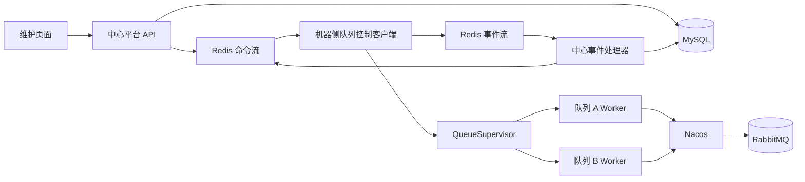
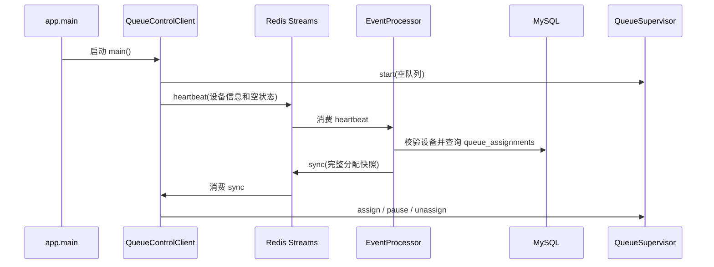

# 队列状态维护架构说明

本文描述当前项目的队列状态维护与远程控制实现，包括设备注册、队列分配、Redis 通知、MySQL 状态、Worker 生命周期和 RabbitMQ 消费链路。

## 1. 设计目标

该方案用于集中维护多台业务机器上的 RabbitMQ 消费队列，支持：

- 在维护页面创建设备，并为设备分配项目中已注册的队列。
- 查看设备在线情况和每个队列的最新运行状态。
- 暂停、恢复、重启单个队列，或重启设备的全部队列。
- 业务代码更新后，通过重启 Worker 进程加载新代码。
- 设备或控制客户端重启后，自动恢复中心已保存的队列分配和暂停意图。
- RabbitMQ 仍从 Nacos 获取连接配置；Redis 仅用于控制通知，MySQL 仅用于中心状态和审计。

## 2. 组件边界



### 2.1 中心控制平台

目录：`queue_control_platform/`

| 模块 | 职责 |
| --- | --- |
| `server/web.py` | FastAPI、维护页面路由、创建命令和发送命令。 |
| `server/repository.py` | MySQL 表结构、设备与队列分配、状态快照和命令审计。 |
| `server/event_processor.py` | 消费 Redis 事件流，状态落库，并在心跳后发送 `sync`。 |
| `server/redis_bus.py` | 中心端 Redis Streams 读写。 |
| `frontend/` | 独立于 `app` 的维护页面。 |
| `docker/compose.yml` | 本地开发使用的 MySQL 和 Redis。 |

中心平台可以单独部署到线上，启动入口为：

```bash
uv run python -m queue_control_platform.server.main
```

该入口使用 Uvicorn 承载 FastAPI。`EventProcessor` 在 FastAPI 的 `lifespan` 启动阶段开始消费 Redis 事件流，并在应用停止阶段结束后台线程。

### 2.2 业务机器的队列控制客户端

目录：`app/control/queue_client/`

| 模块 | 职责 |
| --- | --- |
| `main.py` | 本机队列控制客户端入口。 |
| `config.py` | 读取设备身份、控制 Redis 地址和排空超时。 |
| `client.py` | 接收命令、发送心跳和状态、调用 Supervisor。 |
| `redis_client.py` | 仅实现设备侧 Redis Streams 协议，不依赖 FastAPI 服务端代码。 |

`app.main` 启动的是本机队列控制客户端：

```bash
uv run python -m app.main
```

它不会启动 FastAPI 服务、维护页面、MySQL 或 Redis 服务。

### 2.3 本机 Worker 监管与 RabbitMQ 消费

| 模块 | 职责 |
| --- | --- |
| `app/control/supervisor.py` | 为每个已分配队列创建、暂停、恢复、重启独立 Worker 子进程。 |
| `app/control/worker.py` | 单个 Worker 进程入口和本地排空命令处理。 |
| `app/queue/pausable_rabbitmq.py` | 可暂停 RabbitMQ 消费和执行中任务排空。 |
| `app/config/nacos_config.py` | 加载 Nacos 配置。 |
| `app/config/rabbitmq.py` | 根据 Nacos 配置建立 RabbitMQ 连接参数。 |

每个队列运行在独立的 `multiprocessing spawn` 子进程中。Worker 重启后会重新 import 项目业务代码，因此可加载代码修改后的执行流程。

## 3. 关键配置

业务机器需要配置：

```dotenv
QUEUE_CONTROL_DEVICE_ID=DEV-01
QUEUE_CONTROL_DEVICE_TOKEN=设备注册时返回的令牌
QUEUE_CONTROL_REDIS_URL=redis://控制Redis地址:6379/0
CONTROL_DRAIN_TIMEOUT_SECONDS=1800
```

中心平台需要配置：

```dotenv
QUEUE_CONTROL_MYSQL_URL=mysql://用户名:密码@MySQL地址:3306/queue_control
QUEUE_CONTROL_REDIS_URL=redis://控制Redis地址:6379/0
QUEUE_CONTROL_HOST=0.0.0.0
QUEUE_CONTROL_PORT=8766
```

RabbitMQ 配置仍使用既有 Nacos 配置链路，与 `QUEUE_CONTROL_REDIS_URL` 无关。多台业务机器必须连接同一个中心 Redis 和 MySQL，才能被同一个维护平台控制。

## 4. 设备启动与队列发现



### 4.1 启动顺序

1. `app/main.py` 调用 `app.control.queue_client.main.main()`。
2. `QueueClientSettings.from_environment()` 加载 `.env`，并校验 `QUEUE_CONTROL_DEVICE_ID` 和 `QUEUE_CONTROL_DEVICE_TOKEN`。
3. `QueueControlClient` 创建一个初始队列为空的 `QueueSupervisor`。
4. `QueueControlClient.run_forever()` 启动 Supervisor，立即发送一次 `heartbeat`。
5. 中心事件处理器验证事件后，查询该设备在 MySQL 中的完整队列分配。
6. 中心向该设备命令流发送内部 `sync` 命令。
7. Client 根据 `sync` 内容启动、暂停或移除本机 Worker。

系统不会扫描 RabbitMQ 来决定运行哪些队列。当前机器应当监听哪些队列，由中心 MySQL 的 `queue_assignments` 决定。

### 4.2 定期同步

Client 启动时立即发送一次心跳，之后每 15 秒发送一次。中心每处理一条有效的 `heartbeat`，都会再次下发完整 `sync` 快照。

因此，Client 重启后不依赖历史的 `assign` 命令重放：最多等待下一次心跳处理完成，就可以从中心重新恢复队列分配。首次启动会立即发心跳，通常不需要等待 15 秒。

## 5. Redis Streams 通信协议

### 5.1 流与消费组

| 名称 | 生产者 | 消费者 | 用途 |
| --- | --- | --- | --- |
| `queue-control:commands:<DEVICE_ID>` | 中心平台 | 对应设备 Client | `assign`、`sync`、暂停、恢复、重启等命令。 |
| `queue-control:events` | 所有设备 Client | 中心事件处理器 | 心跳、状态快照、命令处理结果。 |
| `queue-control-agent:<DEVICE_ID>` | - | 设备 Client 消费组 | 设备命令流消费组名称，为兼容已有协议保留该名称。 |
| `queue-control-platform` | - | 中心平台消费组 | 中心事件流消费组。 |

### 5.2 命令格式

中心写入命令流的核心字段如下：

```json
{
  "commandId": "命令审计ID",
  "deviceId": "DEV-01",
  "queueName": "QTCT_ZIM_SI",
  "action": "pause",
  "forceRestart": false
}
```

支持的 `action`：

| 命令 | Client 调用 | 说明 |
| --- | --- | --- |
| `assign` | `supervisor.assign()` | 分配并启动队列。 |
| `sync` | `_sync_assignments()` | 按完整分配快照校正本机状态。 |
| `unassign` | `supervisor.unassign()` | 停止并解除本机队列。 |
| `pause` | `supervisor.pause()` | 排空后停止监听。 |
| `resume` | `supervisor.resume()` | 创建新的 Worker 恢复监听。 |
| `restart` | `supervisor.restart()` | 排空后重建指定队列 Worker。 |
| `restart_all` | `supervisor.restart_all()` | 重启该设备当前所有队列。 |

### 5.3 可靠消费

命令与事件均在处理成功后才调用 `XACK`。

读取消息前会通过 `XAUTOCLAIM` 认领超过 5 秒未确认的 Pending 消息，再读取新消息。因此进程在处理过程中退出后，未确认消息可由重启后的消费者再次取得。

该机制是“至少一次”投递，而不是“恰好一次”。中心通过事件 ID、命令记录和数据库唯一约束降低重复处理的影响；业务任务本身仍应保持幂等。

## 6. 页面操作流程

### 6.1 新增设备

1. 页面调用 `POST /api/devices`。
2. 平台在 `devices` 表中保存设备 ID、显示名称和令牌摘要。
3. API 返回一次性设备令牌。
4. 将设备 ID 和令牌配置到目标业务机器后启动 `app.main`。
5. Client 心跳通过令牌校验后，设备状态更新为在线。

### 6.2 分配队列

1. 页面调用 `POST /api/devices/<device_id>/queues`。
2. 平台写入 `queue_assignments`，默认期望状态为 `RUNNING`。
3. 平台写入 `queue_commands` 审计记录。
4. 平台写入 `assign` Redis 命令。
5. Client 收到命令后创建对应队列的 Worker。

### 6.3 暂停、恢复和重启

1. 页面调用 `POST /api/devices/<device_id>/queues/<queue_name>/commands`。
2. 暂停时，平台先将 `queue_assignments.desired_state` 写为 `PAUSED`；恢复和重启时写为 `RUNNING`。
3. 平台创建命令审计记录，并发送 Redis 命令。
4. Client 执行命令并上报命令结果及队列状态。
5. 中心将事件写入 MySQL；页面轮询 `/api/dashboard` 显示最新快照。

页面收到 HTTP `202` 仅表示命令已被平台接受并写入 Redis，不表示 Worker 已完成暂停或重启。实际结果应以状态刷新和命令结果为准。

## 7. Worker 生命周期

### 7.1 启动和恢复

`QueueSupervisor.assign()` 或 `QueueSupervisor.resume()` 使用 `spawn` 创建独立 Worker 进程。每个 Worker 独立加载业务模块、Nacos RabbitMQ 配置和指定队列消费者。

恢复与重启都创建新 Worker 进程，因此修改业务代码后执行恢复或重启，可以加载新的 Python 代码。

### 7.2 正常暂停与正常重启

```text
页面暂停或正常重启
  -> Client 向 Worker 发送 drain
  -> Worker 停止接收新的 RabbitMQ 消息
  -> 等待已提交任务完成
  -> Worker 退出
  -> 暂停：状态变为 PAUSED
  -> 重启：Supervisor 创建新 Worker
```

排空期间，已经交给 Funboost 执行的任务会继续运行。尚未提交执行的新消息不会被继续消费；需要回队列的消息会使用 `nack(requeue=True)` 重新入队。

### 7.3 强制重启

强制重启直接终止 Worker，不等待执行中的任务完成。若 Worker 在任务处理或 RabbitMQ 确认的边界被终止，消息可能被重新投递，存在重复执行风险。对有外部副作用的业务任务必须实现幂等控制。

## 8. MySQL 数据模型

| 表 | 核心内容 | 用途 |
| --- | --- | --- |
| `devices` | 设备 ID、名称、令牌摘要、最后心跳、在线状态 | 维护设备身份和在线情况。 |
| `queue_assignments` | 设备 ID、队列名、`desired_state` | 维护队列归属及期望运行或暂停状态。 |
| `queue_statuses` | 实际状态、PID、错误、更新时间 | 保存 Client 上报的最新运行快照。 |
| `queue_commands` | 命令、参数、执行结果 | 页面操作的审计和结果追踪。 |
| `queue_events` | Redis 事件 ID 与事件内容 | 去重并保留设备事件记录。 |

`GET /api/dashboard` 只查询 MySQL 快照，不会直接探测业务机器。前端当前每 2 秒请求一次该接口刷新状态。

当 Client 上报空快照时，中心会将之前未出现在快照中的旧运行状态标记为 `UNREPORTED`，并清理过期 PID，防止页面持续显示已经消失的旧 Worker。

## 9. 状态说明

| 状态 | 含义 |
| --- | --- |
| `RUNNING` | Worker 已启动，正在监听 RabbitMQ。 |
| `DRAINING` | 已停止接收新消息，正在等待已执行任务完成。 |
| `PAUSED` | Worker 已退出，不再监听该队列。 |
| `RESTARTING` | 原 Worker 正在退出，等待创建新 Worker。 |
| `FAILED` | Worker 启动或运行失败。 |
| `UNREPORTED` | 中心未收到该队列当前状态，历史 PID 不可信。 |

## 10. 部署与运行要求

1. 中心平台、所有业务机器必须连接同一个 Redis 和 MySQL。
2. 每台业务机器必须有唯一的 `QUEUE_CONTROL_DEVICE_ID`，并使用对应设备令牌。
3. RabbitMQ 地址、账号和队列配置继续由 Nacos 维护，不应与控制 Redis 配置混用。
4. 中心平台的 `EventProcessor` 必须持续运行；否则 Client 虽然会上报心跳，但不会收到心跳触发的 `sync`。
5. 业务机器上的 Client 必须持续运行；否则页面可以创建命令，但设备不会及时接收执行。
6. 线上部署时应分别守护中心平台进程和每台机器的 `app.main` 进程，例如使用 systemd、supervisor、Docker 或 Kubernetes。

## 11. 核心代码索引

| 功能 | 文件 | 关键方法 |
| --- | --- | --- |
| 本机启动 | `app/main.py` | `main()` |
| Client 循环 | `app/control/queue_client/client.py` | `run_forever()`、`_execute_command()`、`_sync_assignments()` |
| Client Redis | `app/control/queue_client/redis_client.py` | `read_commands()`、`publish_event()`、`acknowledge_command()` |
| Worker 监管 | `app/control/supervisor.py` | `assign()`、`pause()`、`resume()`、`restart()` |
| Worker 排空 | `app/control/worker.py` | Worker 入口和 `drain` 命令处理 |
| RabbitMQ 暂停 | `app/queue/pausable_rabbitmq.py` | `request_drain()` 与执行中任务计数处理 |
| 页面 API | `queue_control_platform/server/web.py` | FastAPI 队列分配与控制命令接口 |
| 事件处理 | `queue_control_platform/server/event_processor.py` | `run_once()`、`_send_assignment_snapshot()` |
| MySQL 仓储 | `queue_control_platform/server/repository.py` | `record_agent_event()`、`dashboard()` |
| 中心 Redis | `queue_control_platform/server/redis_bus.py` | `send_command()`、`read_events()` |

## 12. 已知边界

- 中心命令投递和状态事件使用至少一次语义，不能假设业务任务只会执行一次。
- 正常暂停不杀死正在执行的任务；若任务长时间不结束，队列会持续处于排空状态直到超时或任务完成。
- 强制重启会中断 Worker，可能带来消息重复执行。
- 页面状态是 MySQL 中的最后一次上报，不是对 Worker 进程的实时直接探测。
- 维护页面只能分配项目已注册并可由业务 Worker 识别的队列名，不能自动创建新的业务消费者。
