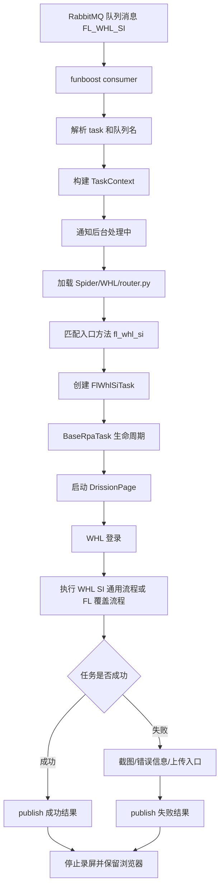

# 分布式 RPA 自动化填单系统首期设计

## 目标

设计一套面向船司自动化填单的轻量分布式 RPA 系统。首期满足现有设计需求文档和队列消息模板即可，重点跑通消息消费、船司路由、浏览器生命周期、任务执行、状态回传、异常截图这条主链路。

技术约束：

- Python 版本：3.12.12
- 虚拟环境：uv
- MQ 框架：funboost
- MQ 服务：RabbitMQ
- 自动化框架：DrissionPage
- 首期配置来源：本地 `.env` 和本地配置文件
- 后续配置来源：nacos

## 架构原则

首期采用“轻量 Worker + 船司通用业务 + 客户入口覆盖”的结构。

队列名格式：

```text
客户名_船司名_业务名
示例：FL_WHL_SI
```

核心原则：

- Worker 根据环境变量订阅队列，例如 `FL_WHL_SI`。
- 系统根据队列名拆出 `customer=FL`、`carrier=WHL`、`business=SI`。
- 船司目录中保存船司通用能力，例如 `WHL_SI.py`、`WHL_VGM.py`。
- 客户入口文件以 `客户名_船司名.py` 命名，例如 `FL_WHL.py`。
- 队列入口方法以 `客户名_船司名_业务名` 命名，方法名统一小写，例如 `fl_whl_si`。
- 客户无个性化时，入口方法直接调用船司通用业务类。
- 客户有个性化时，在客户入口文件中继承船司通用业务类，覆盖局部方法。

这样可以避免每个客户复制一套完整业务文件，同时给客户差异保留清晰入口。

## 目录结构

```text
document_RPA/
  pyproject.toml
  .env
  .env.example
  README.md

  app/
    main.py

    dev/
      __init__.py
      local_runner.py
      template_loader.py

    config/
      __init__.py
      settings.py
      queue_config.py

    queue/
      __init__.py
      consumer.py
      publisher.py
      message.py

    core/
      task/
        __init__.py
        base_task.py
        context.py
        result.py
        errors.py

      browser/
        __init__.py
        manager.py
        options.py
        port.py

      page/
        __init__.py
        dom.py
        wait.py

      integrations/
        __init__.py
        notifier.py
        oss.py
        recorder.py
        captcha.py

      logging/
        __init__.py
        logger.py

    Spider/
      __init__.py
      WHL/
        __init__.py
        router.py
        base.py
        WHL_SI.py
        WHL_VGM.py
        FL_WHL.py
```

目录说明：

- `app/main.py`：程序入口，读取环境变量，启动 funboost 消费者。
- `app/dev/local_runner.py`：本地开发调试入口，不连接 MQ，直接读取本地消息模板并执行业务。
- `app/dev/template_loader.py`：读取本地 JSON 消息模板，默认可使用 `mssage_list/msg_demo.json`。
- `app/config/settings.py`：读取 `.env`，提供 RabbitMQ、浏览器端口、下载目录、用户目录、录屏开关等全局配置。
- `app/config/queue_config.py`：首期维护本地队列配置，后续替换为 nacos 读取。
- `app/queue/consumer.py`：funboost 消费入口，负责接收原始消息并触发任务。
- `app/queue/publisher.py`：结果回传封装。首期先输出结构化日志，后续接入后台接口。
- `app/queue/message.py`：消息解析、字段校验、队列名解析。
- `app/core/task/`：任务上下文、任务生命周期、任务结果、异常定义。
- `app/core/browser/`：DrissionPage 启动、固定端口映射、浏览器参数、用户目录、浏览器接管。
- `app/core/page/`：DOM 操作、页面等待等页面级能力。
- `app/core/integrations/`：通知后台、OSS、录屏、验证码等外部能力入口。
- `app/core/logging/`：中文日志封装。
- `app/Spider/WHL/base.py`：WHL 船司公共登录和页面能力。
- `app/Spider/WHL/WHL_SI.py`：WHL 船司通用 SI 业务。
- `app/Spider/WHL/WHL_VGM.py`：WHL 船司通用 VGM 业务。
- `app/Spider/WHL/FL_WHL.py`：FL 客户在 WHL 船司下的入口和个性化覆盖。
- `app/Spider/WHL/router.py`：WHL 船司队列入口路由。

## 环境变量

首期 `.env` 建议字段：

```dotenv
# 当前环境：local / prod
APP_ENV=local

# 需要消费的队列，多个队列用英文逗号分隔
RPA_QUEUES=FL_WHL_SI

# RabbitMQ 首期本地测试配置
RABBITMQ_HOST=192.168.60.106
RABBITMQ_PORT=5672
RABBITMQ_USER=guest
RABBITMQ_PASSWORD=guest

# 浏览器端口范围
BROWSER_PORT_START=9000
BROWSER_PORT_END=9200

# 下载目录和浏览器用户数据目录
DOWNLOAD_DIR=runtime/downloads
BROWSER_USER_DATA_DIR=runtime/browser_profiles

# 本地默认关闭录屏，线上默认开启
ENABLE_RECORD=false
```

注意：无痕模式不通过环境变量配置。是否无痕由每个船司业务类或客户入口类的类参数定义。

## 运行模式

系统首期支持两种运行模式：队列 Worker 模式和本地调试模式。

### 队列 Worker 模式

线上和联调环境使用队列 Worker 模式。

特点：

- 通过 `app/main.py` 启动。
- 读取 `RPA_QUEUES` 并注册 funboost 消费者。
- 从 RabbitMQ 接收消息。
- 执行处理中通知。
- 按任务配置决定是否录屏。
- 成功或失败后执行结果回传。

### 本地调试模式

开发人员本地开发自动化流程时使用本地调试模式。

特点：

- 不启动 funboost 消费者。
- 不连接 RabbitMQ。
- 不等待队列消息。
- 直接读取本地消息模板，例如 `mssage_list/msg_demo.json`。
- 复用同一套消息解析、`TaskContext`、船司 router 和业务类。
- 默认关闭录屏。
- 默认关闭处理中通知。
- 默认关闭队列结果回传。
- 主要关注浏览器自动化流程是否能跑通。

建议调试入口：

```text
python -m app.dev.local_runner --message mssage_list/msg_demo.json
```

本地调试模式执行流程：

```text
读取本地 JSON 模板
  -> 解析 task
  -> 从 task.rpaTaskTopic 获取队列名，例如 FL_WHL_SI
  -> 构建 TaskContext
  -> 标记 runtime_mode=local
  -> 关闭 notify/publish/record
  -> 根据 carrier 加载 Spider/{carrier}/router.py
  -> router 根据完整队列名找到入口方法
  -> 执行业务自动化
  -> 结果只打印本地日志，不调用队列回执接口
```

## 队列消息模型

消息外层必须包含 `task` 字段。首期关键字段：

- `task.rpaMessageId`：RPA 消息 ID，用于处理中通知和结果回传。
- `task.rpaTaskTopic`：队列主题，例如 `FL_WHL_SI`。
- `task.websiteInfo.websiteType`：船司代码，例如 `WHL`。
- `task.websiteInfo.websiteAccount`：登录账号。
- `task.websiteInfo.websitePassword`：登录密码。
- `task.websiteInfo.websiteUserName`：企业或用户名。
- `task.content`：实际需要填单的数据。
- `task.commonContent`：通用解析内容，必要时给业务兜底参考。
- `task.customContent`：邮件、附件等自定义内容。

构建任务上下文时，系统深拷贝一份 `task.content` 为 `remain_content`。业务每成功处理一个字段，就从 `remain_content` 删除对应字段。任务结束前检查 `remain_content`，用于发现漏填字段。

## 队列 Worker 主流程

```text
启动 app/main.py
  -> 读取 RPA_QUEUES
  -> 为每个队列注册 funboost 消费函数
  -> 消费 RabbitMQ 消息
  -> 校验并解析 task
  -> 解析队列名：customer/carrier/business
  -> 深拷贝 task.content 为 remain_content
  -> 通知后台任务处理中
  -> 根据 carrier 加载 app/Spider/{carrier}/router.py
  -> router 根据完整队列名找到入口方法
  -> 入口方法创建客户业务任务类
  -> 启动 DrissionPage
  -> 执行船司登录
  -> 执行业务填单
  -> 检查 remain_content
  -> 成功时 publish 成功结果
  -> 失败时截图、记录错误、publish 失败结果
  -> 停止录屏
  -> 保留浏览器进程，便于后续同账号同船司任务接管
```

## Mermaid 流程图



## 核心对象设计

### TaskContext

位置：`app/core/task/context.py`

职责：

- 保存原始消息。
- 保存 `task` 对象。
- 保存 `rpa_message_id`、`queue_name`、`customer_code`、`carrier_code`、`business_code`。
- 保存 `website_info` 和登录账号密码。
- 保存 `content` 和 `remain_content`。
- 保存运行模式和本地调试开关。

核心字段：

```python
@dataclass
class TaskContext:
    raw_message: dict
    task: dict
    queue_name: str
    rpa_message_id: str
    customer_code: str
    carrier_code: str
    business_code: str
    website_info: dict
    content: dict
    remain_content: dict
    runtime_mode: str = "queue"
    enable_notify: bool = True
    enable_result_publish: bool = True
    enable_record: bool | None = None
```

### BaseRpaTask

位置：`app/core/task/base_task.py`

职责：

- 统一任务生命周期。
- 调用处理中通知。
- 启动或接管浏览器。
- 控制录屏开始和结束。
- 捕获异常并截图。
- 调用结果回传。

核心方法：

```python
class BaseRpaTask:
    enable_record: bool = False
    incognito: bool = False
    wait_page_load: bool = False
    fail_on_unfilled_fields: bool = False

    def run(self) -> None:
        """执行完整任务生命周期。"""

    def login(self) -> None:
        """船司登录，由船司基类实现。"""

    def execute_business(self) -> None:
        """执行业务填单，由具体业务类实现。"""

    def mark_field_done(self, field_name: str) -> None:
        """字段填入成功后，从 remain_content 删除。"""

    def check_unfilled_fields(self) -> None:
        """检查未填字段。首期默认记录 warning。"""
```

生命周期约定：

- `context.runtime_mode == "queue"` 时，执行处理中通知、录屏和结果回传。
- `context.runtime_mode == "local"` 时，默认跳过处理中通知、录屏和结果回传。
- `context.enable_record is None` 时，使用任务类或环境默认录屏策略。
- `context.enable_record is False` 时，即使任务类开启录屏，本地调试也不录屏。
- 本地调试发生异常时，仍保留本地日志和可选截图，方便开发人员定位自动化问题。

### BrowserManager

位置：`app/core/browser/manager.py`

职责：

- 按 `{websiteUserName 或 websiteAccount}_{carrier_code}` 生成浏览器标识，例如 `DEMO_WHL`。
- 同一个浏览器标识始终使用同一个用户目录和同一个固定端口。
- 如果固定端口已有浏览器运行，则直接接管该端口上的浏览器。
- 如果固定端口没有浏览器运行，则使用该端口启动新浏览器。
- 配置启动参数，例如 `--start-maximized`、证书忽略参数。
- 配置 Chrome prefs，例如下载目录、禁止下载弹窗。
- 根据任务类参数 `incognito` 判断是否无痕。
- 返回 DrissionPage 页面对象。
- 任务成功或失败都不主动关闭浏览器进程。

端口映射策略：

- 首期在 `runtime/browser_profiles/port_registry.json` 维护浏览器标识和端口的映射。
- key 使用浏览器标识，例如 `DEMO_WHL`。
- value 使用固定端口，例如 `9003`。
- 如果 key 已存在，直接复用原端口。
- 如果 key 不存在，从 `BROWSER_PORT_START` 到 `BROWSER_PORT_END` 中选择一个未被其他 key 占用的端口写入映射。
- 端口被同一个 key 占用时视为可接管；端口被不同 key 占用时跳过。

首期默认参数：

```python
DEFAULT_BROWSER_ARGS = [
    "--start-maximized",
    "--ignore-certificate-errors",
]

DEFAULT_PREFS = {
    "download.prompt_for_download": False,
    "download.directory_upgrade": True,
}
```

### DomHelper

位置：`app/core/page/dom.py`

职责：

- 封装常用 DOM 操作，统一日志和异常。
- 元素不存在时默认抛出中文错误。
- 支持 `required=False`，元素不存在时返回空值或 `False`。

建议方法：

```python
class DomHelper:
    def click(self, locator: str, name: str, required: bool = True) -> bool:
        """点击元素。"""

    def input_text(self, locator: str, value: str, name: str, required: bool = True) -> bool:
        """输入文本。"""

    def get_text(self, locator: str, name: str, required: bool = True) -> str:
        """获取元素文本。"""

    def get_value(self, locator: str, name: str, required: bool = True) -> str:
        """获取 input value。"""
```

## 船司业务与客户入口设计

### WHL 船司通用基类

位置：`app/Spider/WHL/base.py`

职责：

- 处理 WHL 登录。
- 处理 WHL 登录态检查。
- 提供 WHL 页面通用操作。
- 继承 `BaseRpaTask`。

示例：

```python
from app.core.task.base_task import BaseRpaTask

class WhlBaseTask(BaseRpaTask):
    carrier_code = "WHL"

    def login(self) -> None:
        """执行 WHL 登录。"""
```

### WHL 通用 SI 业务

位置：`app/Spider/WHL/WHL_SI.py`

职责：

- 封装 WHL 船司 SI 的通用填单流程。
- 默认不包含客户个性化逻辑。
- 将流程拆成可覆盖的小方法，方便客户入口类按需覆盖。

示例：

```python
from app.Spider.WHL.base import WhlBaseTask

class WhlSiTask(WhlBaseTask):
    business_code = "SI"
    incognito = False
    wait_page_load = False

    def execute_business(self) -> None:
        """执行 WHL SI 通用填单流程。"""
        self.fill_booking_no()
        self.fill_shipper()
        self.fill_consignee()
        self.fill_goods()
        self.submit_or_save()

    def fill_booking_no(self) -> None:
        """填写订舱号。"""

    def fill_shipper(self) -> None:
        """填写发货人。"""

    def fill_consignee(self) -> None:
        """填写收货人。"""

    def fill_goods(self) -> None:
        """填写货物信息。"""

    def submit_or_save(self) -> None:
        """保存或提交。"""
```

### WHL 通用 VGM 业务

位置：`app/Spider/WHL/WHL_VGM.py`

职责：

- 封装 WHL 船司 VGM 的通用填单流程。
- 与 SI 一样，流程方法保持可覆盖。

示例：

```python
from app.Spider.WHL.base import WhlBaseTask

class WhlVgmTask(WhlBaseTask):
    business_code = "VGM"
    incognito = False

    def execute_business(self) -> None:
        """执行 WHL VGM 通用填单流程。"""
```

### FL 客户 WHL 入口

位置：`app/Spider/WHL/FL_WHL.py`

职责：

- 定义 `FL_WHL_SI`、`FL_WHL_VGM` 等队列入口方法。
- 无客户个性化时直接使用 WHL 通用业务类。
- 有客户个性化时继承 WHL 通用业务类并覆盖小方法。
- 每个入口方法名称必须是完整队列名的小写形式。

示例：

```python
from app.Spider.WHL.WHL_SI import WhlSiTask
from app.Spider.WHL.WHL_VGM import WhlVgmTask

class FlWhlSiTask(WhlSiTask):
    """FL 客户的 WHL SI 任务。"""

    incognito = False

    def fill_shipper(self) -> None:
        """FL 客户发货人填写个性化。"""
        super().fill_shipper()

def fl_whl_si(context):
    """FL_WHL_SI 队列入口。"""
    return FlWhlSiTask(context).run()

def fl_whl_vgm(context):
    """FL_WHL_VGM 队列入口。"""
    return WhlVgmTask(context).run()
```

### WHL Router

位置：`app/Spider/WHL/router.py`

职责：

- 根据完整队列名找到入口方法。
- 不直接关心业务类细节。
- 队列名必须显式注册，避免误路由。

示例：

```python
from app.Spider.WHL.FL_WHL import fl_whl_si, fl_whl_vgm

ROUTES = {
    "FL_WHL_SI": fl_whl_si,
    "FL_WHL_VGM": fl_whl_vgm,
}

def dispatch(context):
    route = ROUTES.get(context.queue_name.upper())
    if not route:
        raise ValueError(f"WHL 未配置队列入口：{context.queue_name}")
    return route(context)
```

## 配置继承策略

公共默认配置放在 `BaseRpaTask`、船司基类或具体业务类中。全局 `.env` 只放环境相关配置，不放无痕模式。

示例：

```python
class BaseRpaTask:
    enable_record = False
    incognito = False
    wait_page_load = False
    fail_on_unfilled_fields = False

class WhlSiTask(WhlBaseTask):
    incognito = False
    wait_page_load = False

class FlWhlSiTask(WhlSiTask):
    incognito = True
```

录屏开关：

- 全局 `ENABLE_RECORD` 表示当前环境是否默认启用录屏。
- 业务类可通过 `enable_record` 覆盖默认行为。
- 本地调试模式通过 `TaskContext.enable_record=False` 强制关闭录屏。

无痕开关：

- 不配置在 `.env`。
- 只由 `BaseRpaTask`、船司通用业务类、客户入口任务类的类参数决定。
- 客户需要特殊无痕策略时，在 `FL_WHL.py` 中覆盖。

通知和结果回传开关：

- 队列 Worker 模式默认开启处理中通知和结果回传。
- 本地调试模式默认关闭处理中通知和结果回传。
- `BaseRpaTask` 只通过 `context.enable_notify` 和 `context.enable_result_publish` 判断是否调用外部接口。

## 状态回传设计

首期保留统一 `publish_result` 方法。结果回传接口尚未接入前，方法先输出结构化日志；后续接入后台接口时保持入参结构不变。

本地调试模式不调用 `publish_result` 对接队列或后台，只输出本地任务结果日志。

成功结果建议字段：

```json
{
  "rpaMessageId": "2054390608361074688",
  "queueName": "FL_WHL_SI",
  "success": true,
  "message": "任务执行成功",
  "unfilledFields": [],
  "screenshotUrl": "",
  "recordUrl": ""
}
```

失败结果建议字段：

```json
{
  "rpaMessageId": "2054390608361074688",
  "queueName": "FL_WHL_SI",
  "success": false,
  "message": "xx元素不存在",
  "errorType": "ElementNotFoundError",
  "unfilledFields": ["shipperAddress", "totalGoodsDesc"],
  "screenshotUrl": "runtime/screenshots/2054390608361074688_error.png",
  "recordUrl": ""
}
```

处理中通知建议字段：

```json
{
  "rpaMessageId": "2054390608361074688",
  "queueName": "FL_WHL_SI",
  "status": "PROCESSING"
}
```

## 异常分类

位置：`app/core/task/errors.py`

建议异常：

- `RpaError`：基础异常。
- `MessageParseError`：消息结构不正确。
- `QueueNameError`：队列名不符合 `客户_船司_业务`。
- `RouteNotFoundError`：船司 router 未配置对应队列入口。
- `BrowserStartError`：浏览器启动失败。
- `LoginError`：登录失败。
- `ElementNotFoundError`：页面元素不存在。
- `BusinessError`：业务填单失败。
- `UnfilledFieldError`：存在未处理字段。首期默认不抛出，只记录 warning。

首期异常策略：

- 消息无法解析：直接 publish 失败结果，不启动浏览器。
- 路由不存在：直接 publish 失败结果，不启动浏览器。
- 浏览器启动失败：publish 失败结果。
- 登录失败：截图后 publish 失败结果。
- 业务失败：截图后 publish 失败结果。
- 存在未填字段：首期记录 warning 并放入结果字段 `unfilledFields`；是否判失败由具体业务类配置决定。

## 首期开发顺序建议

1. 初始化 `pyproject.toml`、`.env.example` 和基础目录。
2. 实现配置读取。
3. 实现消息解析、队列名解析和 `TaskContext`。
4. 实现 `app/dev/local_runner.py`，支持本地模板直接调试业务。
5. 实现 `BaseRpaTask` 生命周期，并支持本地调试开关。
6. 实现 `BrowserManager` 的固定端口映射、用户目录、浏览器接管和页面创建。
7. 实现 `DomHelper`。
8. 实现 `publisher`、`notifier`、`oss`、`recorder`、`captcha` 的首期占位。
9. 实现 `Spider/WHL/base.py` 登录入口。
10. 实现 `Spider/WHL/WHL_SI.py` 通用 SI 业务骨架。
11. 实现 `Spider/WHL/WHL_VGM.py` 通用 VGM 业务骨架。
12. 实现 `Spider/WHL/FL_WHL.py` 客户入口和个性化覆盖示例。
13. 实现 `Spider/WHL/router.py` 显式路由。
14. 使用 `mssage_list/msg_demo.json` 做本地自动化调试。
15. 接入 funboost 消费本地 RabbitMQ。

## 首期测试策略

优先覆盖不依赖真实船司网站的部分：

- 队列名 `FL_WHL_SI` 能解析为 `FL`、`WHL`、`SI`。
- 消息模板能构建 `TaskContext`。
- `remain_content` 是 `task.content` 的深拷贝。
- `mark_field_done` 能删除已填字段。
- `Spider/WHL/router.py` 能根据 `FL_WHL_SI` 找到 `fl_whl_si`。
- `fl_whl_si` 能创建 `FlWhlSiTask` 并进入任务生命周期。
- 客户任务类能覆盖 WHL 通用业务类的小方法。
- 同一 `websiteUserName/websiteAccount + carrier` 能稳定映射到同一个端口和用户目录。
- 固定端口已有浏览器时，`BrowserManager` 能接管该浏览器而不是重新分配端口。
- 任务成功或失败后不主动关闭浏览器。
- 无痕模式读取任务类 `incognito` 参数，而不是环境变量。
- 本地调试模式能从 `mssage_list/msg_demo.json` 构建上下文并进入 `fl_whl_si`。
- 本地调试模式不调用处理中通知、录屏和结果回传。
- 任务失败时能生成统一失败结果。

真实 DrissionPage 和船司网站登录先做手工联调，等流程稳定后再补自动化集成测试。

## 后续扩展点

- nacos：替换 `queue_config.py` 的本地配置读取。
- OSS：实现截图、录屏、附件上传。
- 录屏：接入线上录屏工具，并在任务成功或失败时回传地址。
- 验证码：在 `captcha.py` 中接入图鉴、云码等平台。
- Worker 心跳：后续需要运维可观测时再增加。
- 后台调度中心：当队列、船司、任务类型明显增多后再考虑。
- 任务重试：首期依赖 MQ/funboost 基础机制，后续按错误类型做精细化重试。

## 非目标

首期不做以下内容：

- 不做独立中心调度服务。
- 不做复杂 Worker 注册和心跳。
- 不做多租户权限系统。
- 不做完整前端管理页面。
- 不一次性实现所有船司业务。
- 不强依赖 nacos、OSS、验证码平台真实可用。
- 不为每个客户复制完整船司业务文件。

## 结论

首期系统以“轻量 Worker + 船司通用业务文件 + 客户入口覆盖 + 通用任务生命周期”为核心。WHL 下的 `WHL_SI.py`、`WHL_VGM.py` 承载船司通用流程，`FL_WHL.py` 负责 `FL_WHL_SI`、`FL_WHL_VGM` 等队列入口和客户个性化覆盖。这样既能满足当前队列消息和自动填单需求，又能避免客户维度过早拆散业务代码。
